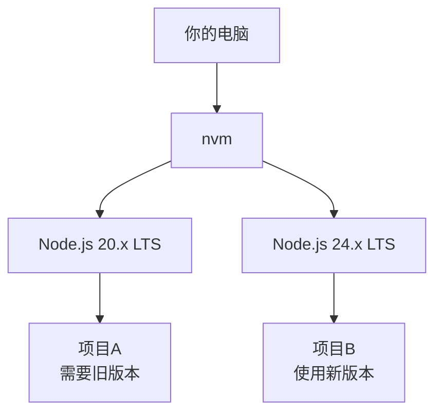

# 1.5 Node.js 环境与包管理


> 本节将完成 Node.js 环境的完整搭建：使用 nvm 安装 Node.js LTS，配置 pnpm 包管理器。

::: tip 完整安装脚本

从 [nvm 中文官网](https://nvm.uihtm.com/) 获取最新安装指南。

:::

## 前置知识

::: tip 什么是 Node.js

Node.js 是 JavaScript 的运行时环境，让 JavaScript 能在服务器端运行。现代前端开发的构建工具都依赖 Node.js。

:::

::: tip 什么是 LTS

LTS（Long Term Support）是长期支持版本，比 Current（最新版）更稳定，推荐用于开发。

:::

::: tip 什么是 nvm

nvm（Node Version Manager）是 Node.js 版本管理器，让你在同一台电脑上安装和切换多个 Node.js 版本。

:::

::: tip 什么是 pnpm

pnpm 是 Node.js 的包管理器，用于安装项目依赖（第三方代码包）。相比 npm，它更快、更节省磁盘空间。

:::

## 核心概念

### 为什么需要 nvm？

不同项目可能需要不同版本的 Node.js。nvm 让你可以轻松切换：

::: tip 什么时候需要切换 Node.js 版本？

以下情况需要使用 nvm 切换版本：

- **老项目维护**：项目依赖旧版本 Node.js（如 18.x、20.x）
- **新项目开发**：使用最新的 LTS 版本（当前为 24.x）
- **兼容性测试**：需要测试不同版本下的运行情况

不使用 nvm 的话，不同版本的项目无法在同一台电脑上同时开发。

:::



### 为什么选择 pnpm？

| 特性 | npm | pnpm |
|------|-----|------|
| 速度 | 基准 | **快 2-3 倍** |
| 磁盘空间（10项目） | ~5GB | **~1.5GB** |
| 严格模式 | ❌ | ✅ |

::: tip npm 项目可以迁移到 pnpm 吗？

可以，而且非常简单：

```bash
# 删除旧的依赖和锁文件
rm -rf node_modules package-lock.json

# 使用 pnpm 安装
pnpm install
```

pnpm 完全兼容 npm 的 `package.json`，迁移后无需修改任何代码。

:::

::: tip 什么是硬链接

**硬链接**是文件系统的一种机制，让同一个文件内容可以被多个文件名指向。

| 方式 | 每个项目都有一份 | 所有项目共享一份 |
|------|-----------------|-----------------|
| **npm** | 复制文件 → 浪费空间 | ❌ |
| **pnpm** | ❌ | 硬链接 → 节省空间 |

npm 每个项目都复制一份依赖，10个项目 = 10 份重复。pnpm 用硬链接让所有项目指向同一份文件，删除硬链接不影响原始文件。

:::

## 实战步骤

### 方式一：Windows 用户

下载 nvm-windows 安装包：https://nvm.uihtm.com/doc/download-nvm.html

下载最新版本的 `.exe` 文件，运行安装程序。

安装完成后打开终端：

```powershell
# 安装最新 LTS 版本（当前为 24.x）
nvm install lts
nvm use lts

# 验证
node -v

# 配置 npm 国内源并安装 pnpm
npm config set registry https://registry.npmmirror.com/
npm install -g pnpm

# 配置 pnpm 国内源
pnpm config set registry https://registry.npmmirror.com/

# 验证
pnpm -v
```

### 方式二：Mac / Linux 用户

```bash
# 一键安装（自动识别 Shell，幂等性，当前终端立即生效）
if [ ! -d ~/.nvm ]; then rm -rf ~/.nvm && git clone https://gitee.com/mirrors/nvm.git ~/.nvm && cd ~/.nvm && git checkout v0.40.3; fi
RC_FILE="${ZSH_VERSION:+$HOME/.zshrc}" && [ -z "$RC_FILE" ] && RC_FILE="$HOME/.bashrc"
grep -q "NVM配置开始" "$RC_FILE" 2>/dev/null || cat >> "$RC_FILE" << 'EOF'
# --- NVM 配置 ---
export NVM_DIR="$HOME/.nvm"
[ -s "$NVM_DIR/nvm.sh" ] && \. "$NVM_DIR/nvm.sh"
export NVM_NODEJS_ORG_MIRROR=https://npmmirror.com/mirrors/node/
EOF
. "$NVM_DIR/nvm.sh" && nvm install --lts && nvm use --lts && nvm alias default lts/*
npm config set registry https://registry.npmmirror.com/ && npm install -g pnpm && pnpm config set registry https://registry.npmmirror.com/
echo "✅ $(node -v) / $(pnpm -v)"
```

## pnpm 常用命令

```bash
# 初始化项目
pnpm init

# 安装所有依赖
pnpm install

# 安装特定包
pnpm add react

# 安装开发依赖
pnpm add -D typescript

# 卸载包
pnpm remove react

# 运行脚本
pnpm dev        # 等同于 pnpm run dev
pnpm build
```

::: tip add 和 add -D 的区别？

- **pnpm add xxx**：安装生产依赖，项目运行时需要（如 React、Next.js）
- **pnpm add -D xxx**：安装开发依赖，仅开发时需要（如 TypeScript、ESLint）

不确定的话，让 AI 决定用哪个。

:::

::: tip 什么是 pnpm-lock.yaml

`pnpm-lock.yaml` 是 pnpm 自动生成的**锁文件**，记录项目每个依赖的精确版本。

```yaml
# pnpm-lock.yaml 内容示例
lockfileVersion: '9.0'
dependencies:
  react:
    version: 18.3.1
    specifier: ^18.0.0
```

**为什么需要 lock 文件**：

| 场景 | 没有 lock 文件 | 有 lock 文件 |
|------|---------------|-------------|
| 你安装 | React 18.3.1 | React 18.3.1 |
| 同事安装 | React 18.3.2（可能不一致） | React 18.3.1（完全一致） |

lock 文件确保所有人安装的依赖版本**完全一致**，避免"在我电脑上能跑，在你电脑上报错"的问题。

**注意事项**：
- 自动生成，**不要手动修改**
- 必须提交到 Git
- 删除后运行 `pnpm install` 会重新生成

:::

## 常见问题

::: tip nvm 命令不生效的排查步骤

如果 `nvm` 命令提示找不到，按以下顺序排查：

1. **确认 Shell 类型**：`echo $SHELL`
2. **重新加载配置**：`source ~/.zshrc` 或 `source ~/.bashrc`
3. **确认 nvm 已安装**：`ls ~/.nvm`
4. **检查配置文件**：确认环境变量已正确写入
5. **重启终端**：完全关闭后重新打开

如果都不行，直接重新运行安装脚本。

:::

### Q1: 运行 nvm 命令提示 `command not found`

**A**: 需要重新加载配置或重启终端。

```bash
# 如果使用 zsh
source ~/.zshrc

# 如果使用 bash
source ~/.bashrc
```

### Q2: 如何查看项目使用哪个 Node.js 版本？

**A**: 大多数项目在 `package.json` 中通过 `engines` 字段说明版本要求。

```bash
# 查看 package.json 中的 engines 字段
cat package.json | grep -A 2 "engines"
```

::: tip 什么是 .nvmrc

`.nvmrc` 是一个**可选**的配置文件，放在项目根目录，指定项目推荐的 Node.js 版本。

```bash
# .nvmrc 文件内容示例
24
```

**但大多数项目没有这个文件**——因为通常使用最新 LTS 版本即可运行。只有当项目必须使用特定版本时，作者才会添加 `.nvmrc`。

如果项目有 `.nvmrc`，进入目录后运行 `nvm use` 即可自动切换。

:::

### Q3: 修改环境变量后为什么终端不生效？

**A**: 需要重启终端。

终端在启动时读取环境变量，修改后已打开的终端不会自动更新。

**解决方法**：
- 关闭当前终端，重新打开
- 或运行 `source ~/.zshrc`（zsh）/ `source ~/.bashrc`（bash）

### Q4: 旧项目用 npm，可以用 pnpm 吗？

**A**: 可以，需要先清理旧文件。

```bash
# 删除 node_modules 和 lock 文件
rm -rf node_modules package-lock.json

# 用 pnpm 安装
pnpm install
```

## 核心理念

**nvm 解决版本冲突，pnpm 提升安装效率**。


选择这套工具组合的原因：
- ✅ 多项目可以使用不同 Node.js 版本
- ✅ pnpm 复用依赖，安装快速、节省空间
- ✅ pnpm 严格模式，避免"幽灵依赖"

## 相关内容

- 详见：[1.4 Terminal终端入门](./04-terminal-basics.md)
- 详见：[nvm 中文官网](https://nvm.uihtm.com/)
- 前置：[1.2 技术栈概念](./02-tech-stack.md)
