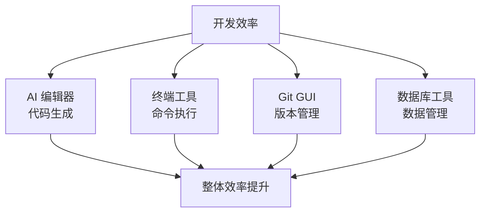

# 1.6 模型与工具


> 环境搭建完成后，选择合适的模型与工具组合能让 AI 编程事半功倍。

## 前置知识

::: danger 什么是 IDE

IDE（Integrated Development Environment）是集成开发环境，包含代码编辑、调试、自动完成等功能。
:::

::: danger 什么是 AI 编程工具

AI 编程工具是集成了 AI 能力的编辑器，能帮你写代码、查错误、解释代码。
:::

::: tip IDE 与 VS Code 的关系

大部分 AI IDE 基于 **VS Code** 开发（VS Code 是开源项目）：
- **Cursor**：VS Code 的分支，深度集成 AI
- **Windsurf**：基于 VS Code，由 Codeium 开发
- **Trae**、**Qoder**：兼容 VS Code 生态

这意味着：
- 界面和操作习惯与 VS Code 一致
- 大部分 VS Code 插件可以通用
- 学习成本很低
:::

## AI IDE 工具

### 国际厂商

| 名称 | 开发商 | 官网 |
|------|--------|------|
| **Cursor** | Anysphere | https://cursor.com |
| **Windsurf** | Windsurf (原 Codeium) | https://windsurf.com |
| **Zed** | Zed Collective | https://zed.dev |
| **GitHub Copilot** | GitHub + OpenAI | https://github.com/features/copilot |
| **JetBrains AI** | JetBrains | https://www.jetbrains.com/ai-assistant |
| **Tabnine** | Tabnine | https://www.tabnine.com |
| **Antigravity** | Google | https://antigravity.google |
| **Kiro** | Kiro Team | https://kiro.dev |

### 国内厂商

| 名称 | 开发商 | 官网 |
|------|--------|------|
| **Trae** | 字节跳动 | https://www.trae.cn |
| **Qoder** | 阿里巴巴 | https://qoder.com |
| **CodeBuddy** | 腾讯 | https://copilot.tencent.com |
| **Comate** | 百度 | https://comate.baidu.com |
| **CodeGeeX** | 清华大学 + 智谱AI | https://codegeex.cn |

## AI CLI 工具

| 名称 | 开发商 | 官网 |
|------|--------|------|
| **Claude Code** ⭐ | Anthropic | https://claude.com/product/claude-code |
| **Codex CLI** | OpenAI | https://openai.com/codex |
| **Qoder CLI** | 阿里巴巴 | https://qoder.com |
| **Factory Droid** | Factory AI | https://factory.ai/product/cli |
| **Warp** | Warpdotdev | https://www.warp.dev |

> ⭐ **Claude Code**：本教程推荐工具，详见下方配置说明

## 其他开发工具

::: tip 什么时候需要 Git GUI 工具？

Git GUI 工具适合以下情况：

- **新手入门**：还不熟悉 Git 命令
- **复杂操作**：需要解决冲突、查看历史
- **可视化需求**：想直观看到分支结构

如果只是简单的提交和推送，命令行更快。

:::

### Git GUI 工具

| 工具 | 平台 | 官网 |
|------|------|------|
| **GitHub Desktop** | 全平台 | https://desktop.github.com |
| **Sourcetree** | 全平台 | https://www.sourcetreeapp.com |
| **Fork** | Mac/Windows | https://git-fork.com |

### 数据库管理工具

::: tip 什么时候需要数据库管理工具？

以下情况建议安装数据库管理工具：

- **频繁查看数据**：需要经常检查数据库内容
- **调试问题**：需要手动修改数据排查问题
- **不熟悉 SQL**：想用图形界面代替命令

如果只是偶尔操作，让 AI 写 SQL 脚本执行即可。

:::

| 工具 | 用途 | 官网 |
|------|------|------|
| **DBeaver** ⭐ | 通用数据库客户端（开源） | https://dbeaver.io |
| **Prisma Studio** | 可视化 Prisma 数据库 | https://www.prisma.io/studio |
| **TablePlus** | 通用数据库客户端 | https://tableplus.com |
| **Beekeeper Studio** | 开源数据库客户端 | https://www.beekeeperstudio.io |
| **HeidiSQL** | Windows 开源数据库工具 | https://www.heidisql.com |
| **DataGrip** | JetBrains 数据库 IDE | https://www.jetbrains.com/datagrip |
| **Adminer** | 轻量级 Web 数据库管理 | https://www.adminer.org |

## 本教程推荐：Claude Code + GLM-4.7 或任意 AI IDE

::: tip 工具与模型的关系

**Claude Code** 是工具，**GLM-4.7** 是模型。

- **工具**负责工作流（文件操作、代码搜索、命令执行）
- **模型**负责思考（生成代码、回答问题、理解上下文）

Claude Code 可以接入多种模型，不限于 Claude。我们选择 GLM-4.7 是因为：
- 国内直连，无网络问题
- 性价比极高（API 价格的 0.1 折）
- 能力完全满足日常开发需求

:::

### 工具与模型选择

| 组件 | 推荐 | 理由 |
|------|------|------|
| **CLI 工具** | Claude Code | 无与伦比的工作流和工具调用能力 |
| **大模型** | GLM-4.7 | 国内直连、性价比极高、能力突出 |
| **AI IDE** | 任意选择 | Cursor/Windsurf/Trae/Qoder 等均可 |

### Claude Code 的优势

**Claude Code** 是 Anthropic 官方推出的 AI 原生开发工具：

- 原生支持文件操作、代码搜索、命令执行
- 内置 Git 集成，自动提交代码
- **支持多模型切换**，不强制使用 Claude
- 强大的上下文理解能力

### 安装 Claude Code

```bash
# 全局安装 Claude Code
npm install -g @anthropic-ai/claude-code
```

### 配置 GLM-4.7

**步骤 1：购买编码套餐**

访问 [智谱 AI 开放平台](https://open.bigmodel.cn/)，购买官方编码套餐，获取 API Key。

::: tip 什么是 API Key

API Key 是调用大模型服务的"通行证"。它是你与智谱 AI 服务器通信的身份凭证，每次调用模型时需要提供这个密钥来验证你的账户和套餐额度。

:::

**步骤 2：自动配置**

使用 coding-helper 工具自动完成配置：

```bash
# 执行自动配置脚本
npx @z_ai/coding-helper

# 输入获取到的 API Key
# 工具会自动完成所有配置
```

### 成本对比

使用 GLM-4.7 编码套餐的优势：

| 对比项 | Claude 官方 | GLM-4.7 编码套餐 |
|--------|-------------|------------------|
| 价格 | $15/$75 每 1M Token | 约 API 价格的 0.1 折 |
| 单次 prompt 调用 | ~$0.03 | ~$0.003 |
| 每月总量（假设） | 几十万 Token | 几十亿 Token |
| 网络环境 | 需要中转 | 国内直连 |

**结论**：对于日常开发，GLM-4.7 编码套餐的性价比极高，完全够用。

配置完成后，详见第2章"Claude Code 工作流详解"学习使用方法。

## 常见问题

### Q1: 必须用 AI 编辑器吗？

**A**: 是的，这是本教程的核心。

Vibecoding 理念建立在 AI 原生开发之上，AI 编辑器能显著提升开发效率，特别是对于新手。你可以选择任意喜欢的 AI IDE（Cursor/Windsurf/Trae/Qoder 等），或使用 Claude Code 这样的 CLI 工具。

### Q2: Cursor 和 VS Code 什么区别？

**A**: Cursor 是 VS Code 的 AI 增强版。

- VS Code：传统编辑器，手动安装 AI 插件
- Cursor：AI 原生，深度集成 AI 能力

如果你已经熟悉 VS Code，切换到 Cursor 成本很低。

### Q3: 数据库管理工具必须装吗？

**A**: 最好装，或者让 AI 帮你完成数据库操作。

Prisma Studio 内置在 Prisma 中，启动即可：

```bash
npx prisma studio
```

推荐安装 DBeaver，功能强大且开源。你也可以让 AI 通过命令行或脚本来完成数据库操作，无需手动管理。

## 核心理念

**工欲善其事，必先利其器**。



**工具选择原则**：
1. **AI 原生优先**：现代开发离不开 AI
2. **跨平台考虑**：工具在 Mac/Windows 都可用
3. **学习成本低**：避免过于复杂的工具
4. **社区活跃**：有文档、有更新

**最低配置**：
- AI 编辑器（Cursor/Windsurf）
- 系统自带终端
- 浏览器（Chrome/Firefox）

**进阶配置**：
- Git GUI 工具
- 数据库管理工具
- API 测试工具（Postman/Thunder Client）

## 相关内容

- 详见：[第2章 AI使用说明书](../02-ai-tuning-guide/index.md)
- 详见：[2.2 VibeCoding工作流](../02-ai-tuning-guide/02-vibecoding-workflow.md)
- 前置：[1.4 Terminal终端入门](./04-terminal-basics.md)
- 前置：[1.5 Node.js环境与包管理](./05-nodejs-package-manager.md)
