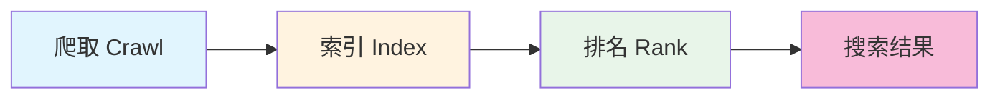

# 15.2 SEO 全攻略

> 搜索引擎的爬虫是"瞎子"，你得给它指路。但指完路之后，真正决定排名的是内容本身。

---

## 小明搜不到自己的网站

小明在百度、和谷歌里搜自己的网站名，翻了十页都找不到。

"我的网站明明上线了啊，为什么搜索引擎不收录？"

他试着搜了几个和自己产品相关的关键词，结果全是别人的网站。他的网站就像一家开在深巷里的店——确实存在，但没有人知道。

老师傅说："搜索引擎的爬虫不会自动发现你。互联网上每天有几百万个新页面诞生，爬虫不可能挨个找。你得主动告诉它你在哪、你有什么。"

---

## SEO 是什么，为什么值得花时间

**SEO（Search Engine Optimization，搜索引擎优化）** 是让网站在搜索结果中获得更好排名的方法。

对独立开发者来说，SEO 可能是性价比最高的获客方式：

| 价值 | 说明 |
|------|------|
| 免费流量 | 不需要付费广告就能获得访问 |
| 持续收益 | 好的 SEO 效果可以长期维持——你睡觉的时候也有人通过搜索找到你 |
| 精准用户 | 搜索用户有明确需求，他们主动在找你能解决的问题 |
| 品牌曝光 | 排名靠前本身就是一种信任背书 |

和上一节讲的社交分享不同，SEO 带来的流量是"细水长流"型的。社交分享像放烟花——发一次，热闹一阵就没了。SEO 像种树——前几个月看不到什么效果，但一旦排名上去了，每天都有稳定的流量进来，不需要你反复推广。

### 搜索引擎怎么工作

要做好 SEO，首先得理解搜索引擎是怎么运作的。整个过程分三步：

**第一步：爬取（Crawling）**。搜索引擎有一群"爬虫"程序，它们从已知的网页出发，沿着页面上的链接跳到新的页面，就像蜘蛛沿着蛛网爬行。如果没有任何链接指向你的网站，爬虫就发现不了你——这就是小明遇到的问题。

**第二步：索引（Indexing）**。爬虫发现了你的页面后，会把页面内容抓取下来，分析里面有什么信息，然后存入一个巨大的数据库（索引）。这一步就像图书馆把新书编目入库——书到了图书馆，但还没上架。

**第三步：排名（Ranking）**。当用户搜索某个关键词时，搜索引擎从索引中找出所有相关的页面，然后根据几百个因素（内容相关性、页面质量、网站权威性、用户体验等）给它们排序。排在前面的，就是用户看到的搜索结果。

理解了这三步，SEO 的逻辑就清晰了：**第一，让爬虫能找到你（技术配置）；第二，让爬虫能理解你（内容优化）；第三，让搜索引擎觉得你比别人好（质量和权威）**。

---

## 基础配置三件套：让爬虫找到你

SEO 的技术基础就三样东西：**Metadata + Sitemap + Robots.txt**。这是"入场券"——没有它们，搜索引擎连你的网站是什么都不知道。

好消息是，这三样东西都是标准化的配置，告诉 Claude Code 你需要配置 SEO 基础设施，它会一次性帮你搞定。

<SEOProcess />

### Metadata（元数据）

Metadata 是你告诉搜索引擎"这个页面是关于什么"的方式。最重要的两个字段：

- **`title`**：页面标题，会直接显示在搜索结果里。这是用户决定是否点击的第一要素。
- **`description`**：页面描述，显示在搜索结果标题下方的灰色文字。好的描述能显著提升点击率。

每个页面都应该有独特的 title 和 description。如果所有页面的标题都是"我的网站"，搜索引擎会觉得你的网站内容单一，用户也分不清哪个页面是他要找的。

### Sitemap（站点地图）

Sitemap 是一个 XML 文件，列出了你网站的所有页面以及它们的更新时间。你可以把它理解为给爬虫的一张"导览图"——"嘿，我的网站有这些页面，这几个是最近更新的，优先来看看。"

没有 Sitemap，爬虫只能靠链接一个一个发现你的页面，可能会遗漏一些没有被其他页面链接到的"孤岛"页面。有了 Sitemap，爬虫可以一次性知道你所有的页面。

### Robots.txt

Robots.txt 告诉爬虫哪些页面可以抓取、哪些不行。比如你不希望搜索引擎索引你的 `/api/` 接口或 `/admin/` 后台页面——这些页面出现在搜索结果里没有意义，还可能暴露敏感信息。

Robots.txt 也是你告诉爬虫 Sitemap 位置的地方。爬虫访问你的网站时，通常会先看 `robots.txt`，从里面找到 Sitemap 的 URL，然后按照 Sitemap 去爬取页面。

### 在 Next.js 中配置

这三样配置在 Next.js 中都有标准的文件约定：`metadata` 对象配置元数据、`app/sitemap.ts` 生成站点地图、`app/robots.ts` 配置爬虫规则。加载了 `next-best-practices` Skill 的 Claude Code 处理起来毫无压力——这些都是框架的标准功能，不需要任何第三方库。

---

## 小明的网站被收录了

小明让 Claude Code 配好了 SEO 三件套。然后他去各大搜索引擎的站长工具提交了 Sitemap：

1. [Google Search Console](https://search.google.com/search-console)——Google 的站长工具，注册后提交 Sitemap 即可
2. [Bing Webmaster Tools](https://www.bing.com/webmasters)——Bing 的站长工具，流程和 Google 类似

这两个平台都是免费的，提交 Sitemap 相当于主动告诉搜索引擎："嘿，我的网站在这里，这是我的页面列表，来看看吧。"

至于百度，小明也想提交，但发现百度站长平台对个人网站的门槛比较高——需要验证网站所有权，而且对未备案的网站收录意愿很低。小明的服务器在香港，没有 ICP 备案，百度这边暂时搞不定。老师傅说："先把 Google 和 Bing 搞好，百度的事等以后服务器迁到国内再说。"

过了两周，小明在 Google 上搜自己的网站名——终于出现在搜索结果里了！虽然排名很靠后，在第三页，但至少被收录了。

"怎么才能排到前面？"

老师傅说："技术配置只是入场券，它解决的是'能不能被找到'的问题。但'排在第几'，取决于你的内容质量。"

---

## 内容才是 SEO 的核心

很多人以为 SEO 就是配置一堆技术参数，其实不是。技术配置只占 SEO 的一小部分，真正决定排名的是**内容本身**。

想想看：搜索引擎的目标是什么？是给用户提供最有价值的搜索结果。如果你的页面内容确实能解决用户的问题，搜索引擎没有理由不把你排在前面。反过来，如果你的内容空洞无物，再多的技术优化也救不了你。

### 标题优化

标题是搜索结果中最醒目的元素，也是用户决定是否点击的第一要素。

| 原则 | 说明 |
|------|------|
| 关键词前置 | 把最重要的关键词放在标题开头——用户扫描搜索结果时，视线从左到右 |
| 长度适中 | 50-60 个字符最佳，太长会被截断显示省略号 |
| 独特性 | 每个页面的标题必须不同，否则搜索引擎会困惑 |

好的标题结构：`主关键词 | 副关键词 | 品牌名`

比如：`Next.js 部署教程 | Vercel 一键部署指南 | 小明的技术博客`

### E-E-A-T 原则

Google 评估内容质量有一个核心框架叫 **E-E-A-T**：

- **Experience（经验）**：作者是否有实际经验？写部署教程的人，自己部署过吗？
- **Expertise（专业）**：内容是否展示了专业知识？是泛泛而谈还是有深度？
- **Authoritativeness（权威）**：网站和作者在这个领域是否有权威性？
- **Trustworthiness（可信）**：内容是否可信？有没有引用来源？

这听起来很抽象，但核心就一句话：**写你真正懂的东西，提供真正有价值的内容**。

搜索引擎越来越聪明了。十年前你可以靠堆砌关键词骗到排名，现在不行了。Google 的算法能判断一篇文章是真的有干货，还是为了 SEO 而拼凑的水文。所以最好的 SEO 策略，其实就是认真写好内容。

### URL 结构

URL 也是搜索引擎理解页面内容的信号之一。

| 好的 URL | 差的 URL |
|---------|---------|
| `/blog/how-to-learn-nextjs` | `/post?id=123` |
| `/products/laptops` | `/products?type=1&cat=2` |

好的 URL 应该是：短的、描述性的、用连字符分隔单词、全小写。用户看到 URL 就能大概猜到页面内容，搜索引擎也一样。

---

## 页面速度：用户体验也是排名因素

Google 在 2021 年正式把页面体验纳入排名因素。这意味着，即使你的内容很好，如果页面加载很慢、交互卡顿、布局跳来跳去，排名也会受影响。

### Core Web Vitals

Google 定义了三个核心指标来衡量页面体验：

| 指标 | 良好值 | 说明 |
|------|--------|------|
| **LCP** | < 2.5s | 最大内容绘制——页面主要内容多快能显示出来 |
| **INP** | < 200ms | 交互到下一次绘制——用户点击按钮后多快能看到响应 |
| **CLS** | < 0.1 | 累积布局偏移——页面加载过程中内容是否会突然跳动 |

你不需要成为性能优化专家。大部分现代框架（Next.js、Nuxt 等）已经内置了很多优化：自动代码分割、图片优化、预加载等。但有几个方向值得关注：

- **图片**：用 WebP 格式代替 JPG/PNG，文件更小、质量相当。Next.js 的 `<Image>` 组件会自动处理。
- **代码分割**：按需加载代码，用户访问首页时不需要加载"关于我们"页面的代码。
- **缓存**：利用浏览器缓存和 CDN，让回访用户不需要重新下载所有资源。
- **压缩**：启用 Gzip 或 Brotli 压缩，减少传输数据量。

这些优化 Claude Code 也能帮你检查和调优。你可以用 Google 的 [PageSpeed Insights](https://pagespeed.web.dev/) 工具测试你的页面得分，它会给出具体的优化建议。

### 结构化数据

结构化数据是另一个进阶技巧。它用 JSON-LD 格式告诉搜索引擎页面内容的"结构"——比如这是一篇文章，作者是谁，发布时间是什么，有没有评分。

搜索引擎读取结构化数据后，可能会在搜索结果中显示"富文本摘要"——比如文章的发布日期、产品的评分星级、FAQ 的问答列表。这些富文本摘要比普通的搜索结果更醒目，点击率也更高。

常见的结构化数据类型：Article（文章）、Product（产品）、FAQPage（常见问题）、BreadcrumbList（面包屑导航）。告诉 Claude Code 你需要添加结构化数据，说明你的页面类型即可。

---

## 加速索引：让搜索引擎更快发现你

配好了 SEO 基础设施后，你可能还需要等一段时间才能被搜索引擎收录。以下方法可以加速这个过程：

| 方法 | 说明 |
|------|------|
| 提交 Sitemap | 向 Google Search Console、Bing Webmaster Tools 提交——这是最直接的方式 |
| 主动推送 | 部分站长平台支持通过 API 主动推送新页面 URL |
| 外部链接 | 如果已被索引的网站链接到你，爬虫会沿着链接发现你 |
| 社交媒体 | 在社交媒体分享链接（呼应 15.1 的 OG 配置），爬虫也会从社交平台发现你 |

其中"外部链接"是最有价值的。如果一个权威网站链接到你，搜索引擎会认为你的内容也有价值——这就像学术论文的引用，被引用越多，说明越有影响力。但外部链接不是你能直接控制的，它取决于你的内容是否真的值得被引用。

---

## Google 和 Bing vs 百度：两个世界的差异

对于服务器在海外的个人项目，Google 和 Bing 是你的主战场。它们对海外服务器没有歧视，提交 Sitemap 后通常几周内就能被收录。

百度则是另一个世界。如果你的用户主要在国内，百度的 SEO 值得关注，但门槛明显更高：

| 维度 | Google / Bing | 百度 |
|------|--------|------|
| 收录门槛 | 提交 Sitemap 即可，对服务器位置无要求 | 强烈偏好国内服务器，未备案网站几乎不收录 |
| 内容评估 | E-E-A-T 原则，重视内容深度 | 重视原创内容，对抄袭惩罚严格 |
| 技术要求 | Core Web Vitals 是排名因素 | 更重视国内主机的访问速度 |
| 移动端 | 移动优先索引（先看移动版） | 移动端权重同样很高 |
| 安全/合规 | HTTPS 是排名因素 | ICP 备案几乎是收录的前提条件 |

简单说：**百度 SEO = 国内服务器 + ICP 备案 + 内容优化**。如果你的服务器在海外且没有备案，百度基本不会收录你。这不是技术配置能解决的问题，而是基础设施的选择。

小明的服务器在香港，所以他先专注 Google 和 Bing。等以后产品面向国内用户、服务器迁到大陆并完成备案后，再来攻百度。关于 ICP 备案的详细说明，在 15.4 法律合规中会讲到。

---

## SEO 检查清单

上线前过一遍这个清单，确保基础工作都到位了：

<SEOChecklist />

**基础配置**

SEO 基础设施（Metadata、Sitemap、Robots.txt）由 Claude Code 根据你的 Next.js 项目一次性配置完成。加载了 `next-best-practices` Skill 的 Claude Code 会自动处理这些标准功能。

你需要做的是：
- [ ] 向 Google Search Console 和 Bing Webmaster Tools 提交 Sitemap

**内容质量**（需要你的审核）
- [ ] 内容原创，能解决用户的实际问题
- [ ] 使用语义化 HTML 结构（h1 → h2 → h3 层级清晰）
- [ ] 图片有 alt 描述（帮助搜索引擎理解图片内容）

**技术优化**（框架已处理，但值得确认）
- [ ] URL 简洁、描述性强
- [ ] 页面加载速度良好（用 PageSpeed Insights 测试）
- [ ] 移动端友好（响应式设计）
- [ ] HTTPS 加密

---

## 常见问题

### Q1: SEO 多久能看到效果？

通常 3-6 个月。新站点需要时间被搜索引擎发现和建立信任。这不是配置完就能立竿见影的事情——搜索引擎需要时间来爬取你的页面、评估你的内容质量、观察用户的行为数据。

不要因为一两个月没看到效果就放弃。SEO 是长期投资，但一旦起效，回报是持续的。

### Q2: 关键词密度多少合适？

没有标准值，也不需要刻意计算。自然写作即可。

十年前，SEO 圈子流行"关键词密度 2%-5%"的说法，于是很多人在文章里疯狂堆砌关键词。现在的搜索引擎早就不吃这一套了——它们用语义理解来判断内容相关性，而不是简单地数关键词出现了几次。刻意堆砌关键词反而会被判定为"关键词填充"，导致排名下降。

---

小明的网站排名在慢慢上升。从第三页到第二页，又从第二页到第一页的底部。他开始关注一个新问题：这些通过搜索和社交分享来的访客，来了之后都在做什么？哪些页面最受欢迎？用户从哪里离开的？

是时候看看数据了。
