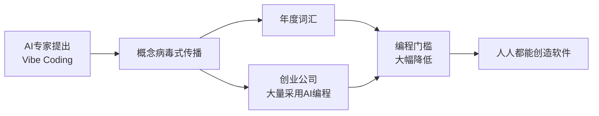

# 1.1.1 2025 年，编程世界发生了什么

## 一个观点引发的革命

2025年2月，AI 领域的资深专家在社交媒体上分享了一个观点：

> "有一种新的编程方式，我称之为 'vibe coding'（氛围编程）。你完全沉浸在感觉中，拥抱指数级变化，甚至忘记代码的存在。"

这个观点引发广泛讨论的原因是——**我们正在进入一个不需要"写"代码也能"做"软件的时代**。

## "Vibe Coding" 成为年度热词

2025年11月，权威词典机构宣布：**"Vibe Coding"** 当选年度词汇。

这个词的官方定义是：

> 一种使用人工智能、通过自然语言描述来生成计算机代码的方式。

换句话说，你不需要学什么编程语言，只要用自然语言告诉 AI "我想要一个 XX"，它就能帮你做出来。

## 数据不会说谎

以下是相关数据：

::: info 创业公司的 AI 使用趋势
根据行业观察，越来越多的创业公司开始大量使用 AI 生成代码。

一些创业公司报告称，**它们超过 90% 的代码是由 AI 生成的。**

这些不是玩票的业余项目，而是正在融资、正在增长的真实创业公司。
:::

更让人惊讶的是，这些公司的团队规模往往不到10人，却能做出以前需要几十人才能完成的产品。

## 更多数据佐证

更多行业数据：

| 指标 | 数据 |
|------|------|
| 使用AI编程工具的美国开发者 | 92% |
| 全球代码中AI生成的比例 | 41% |
| Vibe Coding用户中非开发者占比 | 63% |
| 使用AI后开发速度提升 | 最高55% |
| 市场规模预测（2032年） | 从49亿→301亿美元 |

*数据来源：行业调研报告（2025）*

注意那个 **63%**——超过一半的 Vibe Coding 用户根本不是程序员。他们是设计师、产品经理、创业者、甚至文科生。

## 真实案例：看看他们用 AI 做了什么

数据很抽象，让我们看看真实的人是如何用 AI 编程的。

### 案例 1：设计师做了一个待办事项应用

**背景：** 一位 UI 设计师，没有编程经验，想做一个个人使用的待办事项应用。

**使用工具：** Claude Code + Cursor

**开发时间：** 2 小时

**实现功能：**
- ✅ 添加、编辑、删除任务
- ✅ 任务分类和标签
- ✅ 数据本地存储
- ✅ 响应式设计，支持手机和电脑

::: details 查看实现过程
1. 用自然语言描述需求："我想要一个简洁的待办事项应用，支持任务分类和标签"
2. AI 生成基础代码框架（HTML + CSS + JavaScript）
3. 通过对话迭代优化 UI 样式："把按钮改成圆角，颜色用蓝色系"
4. 添加数据持久化："帮我把数据保存到浏览器本地存储"
5. 部署到 Vercel，获得在线访问链接
:::

**关键洞察：** 这位设计师完全不懂 JavaScript，但通过自然语言对话，2 小时就做出了可用的产品。

---

### 案例 2：产品经理搭建了用户反馈系统

**背景：** 一位产品经理需要快速搭建一个用户反馈收集系统，用于收集产品改进建议。

**使用工具：** Claude Code + Next.js + Supabase

**开发时间：** 4 小时

**实现功能：**
- ✅ 用户提交反馈表单
- ✅ 管理后台查看所有反馈
- ✅ 反馈状态管理（待处理/进行中/已完成）
- ✅ 邮件通知功能

::: details 查看实现过程
1. 编写简单的 PRD 文档描述需求
2. AI 生成前后端代码框架
3. 集成 Supabase 数据库存储反馈数据
4. 配置邮件服务（使用 Resend）
5. 添加简单的管理后台界面
6. 部署上线，团队开始使用
:::

**关键洞察：** 这位产品经理之前只会写 SQL，现在能独立完成全栈开发。团队节省了 2 周的开发时间。

---

### 案例 3：创业者开发了 SaaS 产品原型

**背景：** 一位创业者想验证一个 SaaS 产品想法（在线协作工具），需要快速做出 MVP 来测试市场。

**使用工具：** Claude Code + Next.js + Supabase + Stripe

**开发时间：** 1 周

**实现功能：**
- ✅ 用户注册登录（邮箱 + Google OAuth）
- ✅ 订阅付费系统（月付/年付）
- ✅ 核心功能模块（协作看板）
- ✅ 数据分析面板
- ✅ 用户权限管理

::: tip 真实成果
这位创业者在没有技术团队的情况下，独立完成了产品从 0 到 1，并在 2 个月内获得了前 100 个付费用户，验证了产品的市场需求。
:::

**关键洞察：** 传统方式需要招聘前端、后端、设计师，至少 3 个月才能做出 MVP。现在 1 个人 1 周就能完成。

---

### 这些案例说明了什么？

| 传统开发 | AI 辅助开发 |
|---------|------------|
| 需要学习编程语言（数月到数年） | 用自然语言描述需求（立即开始） |
| 需要组建技术团队（3-5人） | 1 个人就能完成 |
| MVP 开发周期 2-3 个月 | MVP 开发周期 1-2 周 |
| 成本：人力 + 时间 | 成本：AI 工具订阅费 |

**编程正在从"专业技能"变成"通用工具"。**

## 这场变革的本质

让我们把这几件事串起来：

::: tip 核心洞察
就像 Excel 让每个人都能处理数据，Word 让每个人都能排版文档一样，AI 编程工具正在让每个人都能创造软件。

**你不需要成为程序员，就能做出软件产品。**
:::

## 小结

2025 年是 Vibe Coding 元年。从概念提出到成为年度词汇，从数据统计到真实案例，我们看到：

- **编程门槛大幅降低**：设计师 2 小时做出应用，产品经理 4 小时搭建系统
- **开发效率显著提升**：创业者 1 周完成传统需要 3 个月的 MVP
- **角色边界正在模糊**：63% 的 Vibe Coding 用户不是程序员

接下来，我们看看这场变革如何改变开发者的角色——从"码农"到"指挥官"。
