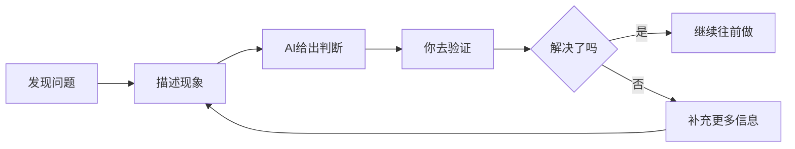

# 0.3 卡住时怎么办：基础版统一求助流程

## 先建立一个比“硬扛”更好的反应

很多新手一遇到问题，第一反应往往都差不多：开始乱改代码，一条一条搜索报错，怀疑“是不是我不适合学这个”，然后在一个问题上卡很久，不敢继续。

基础篇不建议你走这条路。

在 AI 编程时代，更有效的第一反应是：

> **先把问题描述清楚，再让 AI 帮你继续推进。**

这不是偷懒，而是一种更省力也更高效的工作方式。

## 统一求助公式

当你卡住时，优先按这个顺序告诉 AI：我刚刚做了什么，现在看到了什么问题，我本来想要什么结果。如果能配上截图或完整报错，就更好。

## 最简单的提问模板

```text
我刚刚在做：[你刚刚做了什么]

现在出现的问题是：[你现在看到的现象]

我原本希望得到的结果是：[你想达到什么效果]

请先帮我判断最可能的原因，再告诉我下一步该怎么做。
```

## 三个常见例子

### 例子 1：页面空白

```text
我刚刚让 AI 帮我修改了主页的布局。

现在页面打开后是空白的。

我本来想看到修改后的主页，请先帮我判断最可能的原因，再告诉我下一步该怎么做。
```

### 例子 2：按钮没反应

```text
我刚刚加了一个发送按钮。

现在点击之后没有任何反应。

我本来希望点击后能发送消息，请帮我先定位最可能的问题。
```

### 例子 3：聊天结果不对

```text
我刚刚更新了数字分身的说明信息。

现在它回答得还是很机械，而且没有按我的设定来。

我希望它更像我本人，请帮我判断是说明写得不够清楚，还是哪里没有生效。
```

## 如果第一次没解决怎么办

第一次没解决，不代表你就失败了。很多问题本来就不是“一问就结束”，而是一个小迭代过程：



更好的做法是，把新的现象告诉 AI，说明你刚刚按它的建议做了什么，然后继续推进下一轮判断。

## 什么信息最值得补充

如果第一次回答还不够，你下一步最值得补的，通常就是截图、完整报错原文、你刚刚改了哪个部分，以及你现在看到的结果和预期差在哪里。

不要只说“它不对”“它坏了”“还是不行”。这类信息太少，AI 也很难帮你判断。

## 记住：不要把所有问题都归咎于 AI

如果出现问题，不要第一时间想“AI 又写错了”。很多时候，更真实的情况是：你没有把目标说清楚，没有限制改动范围，环境或配置没有准备好，或者某一步其实没有按预期生效。

这不是在责怪你，而是在帮你建立一个更稳的协作视角：

**问题出现时，先看上下文、目标、边界、环境，而不是先把责任扔给 AI。**

::: details 想深入一点？
如果你想系统理解 AI 调试、工作流和项目规则，可以跳转到进阶版继续读：
- [第二章：AI 使用说明书](/Advanced/02-ai-tuning-guide/)
:::

---

[下一节：本章小结：基础版学习地图 →](./0.4-how-to-learn.md)
