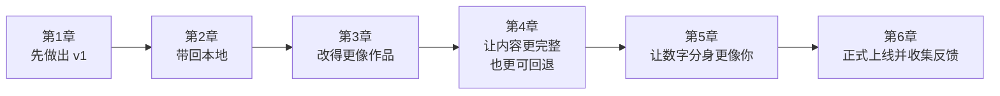

# 0.4 本章小结：基础版学习地图

## 现在，把整条路线看清楚

到这里，你已经知道这套基础篇教什么、不教什么，也知道自己最终会做出什么、这条路线适不适合你，以及卡住时该怎么继续。

接下来最重要的一件事，就是把整条路线看清楚。因为一旦你知道自己现在处在哪个阶段、下一步为什么要做、做完会得到什么，焦虑会一下少很多。

## 整条路线长什么样

## 每一章把作品推进到哪里

| 章节 | 作品会发生什么变化 |
|------|--------------------|
| 第 1 章 | 你会先做出一个能预览、能展示、能简单聊天的 `v1` |
| 第 2 章 | 这个作品会从平台搬到你自己的电脑里，变成可持续修改的项目 |
| 第 3 章 | 首页会从默认模板，变成更像认真做过的作品 |
| 第 4 章 | 作品不再单薄，访客会更容易理解你是谁，也更知道该问什么 |
| 第 5 章 | 数字分身不再只是“会回话”，而是开始像你本人 |
| 第 6 章 | 作品从“只在你电脑里”变成“别人也能访问的正式链接” |

## 这条路会把你慢慢带到哪里

这里先不谈抽象能力标签，只看更实际的变化。你会先学会把需求说清楚，再把作品带回自己的工作台，接着判断页面是不是更像作品、是不是更好用，也学会给代码留后路，不至于一改就慌。再往后，你会开始让数字分身更像你，最后把整个项目真正发出去，让别人看到。

## 什么时候该停下来，什么时候该继续

如果你只想先体验一次“我也能做出来”，那做到第 1 章就已经很值了。

如果你想完成第一次完整闭环，就继续一路做到第 6 章。这两种都不是失败，也不是偷懒。区别只是：第 1 章结束时，你拿到的是第一次正反馈；第 6 章结束时，你拿到的是第一次完整作品闭环。

## 到这里，你已经弄清了什么

你已经看清了这本教程的定位，知道自己最终会做出什么，也知道怎么学、怎么问、怎么继续推进。更重要的是，后面每一章会把作品带到哪里，你现在心里已经有数了。

## 出发前，至少确认这几件事

- [ ] 我知道这套基础篇不是传统语法课
- [ ] 我知道自己最终会做出什么作品
- [ ] 我知道这条路线是否适合我
- [ ] 我知道卡住时该如何向 AI 求助
- [ ] 我知道第 1 章到第 6 章分别在推进什么

## 下一步

接下来就别继续停留在“准备阶段”了。你已经知道路线，也知道自己最终要做什么。下一步最重要的不是再看一篇解释，而是开始做出第一个版本。

如果你想系统理解环境与工具、AI 工作流、产品文档、UI/UX、API、安全、Git 协作或部署，可以在后续遇到边界时跳去进阶版；但现在，你已经具备进入第 1 章的全部前提。

---

[进入第 1 章：第一个版本 →](/Basic/01-awakening/)
