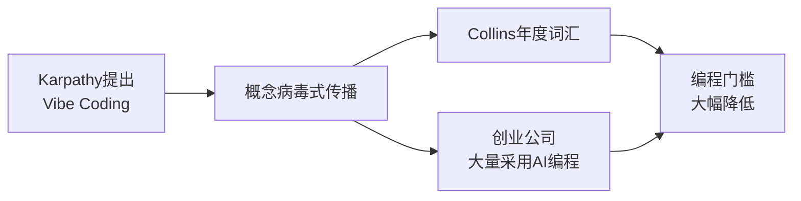

# 1.1.1 2025 年，编程世界发生了什么

## 一条推文引发的革命

2025年2月，前特斯拉AI总监、OpenAI联合创始人 Andrej Karpathy 在社交媒体上发了一条推文。

他说：

> "有一种新的编程方式，我称之为 'vibe coding'（氛围编程）。你完全沉浸在感觉中，拥抱指数级变化，甚至忘记代码的存在。"

这条推文引发广泛讨论的原因是——**我们正在进入一个不需要"写"代码也能"做"软件的时代**。

## "Vibe Coding" 成为年度热词

2025年11月，柯林斯词典宣布：**"Vibe Coding"** 当选年度词汇。

这个词的官方定义是：

> 一种使用人工智能、通过自然语言描述来生成计算机代码的方式。

换句话说，你不需要学什么编程语言，只要用自然语言告诉AI"我想要一个XX"，它就能帮你做出来。

## 数据不会说谎

以下是相关数据：

::: info 创业公司的 AI 使用趋势
根据行业观察，越来越多的创业公司开始大量使用 AI 生成代码。

一些创业公司报告称，**它们超过 90% 的代码是由 AI 生成的。**

这些不是玩票的业余项目，而是正在融资、正在增长的真实创业公司。
:::

更让人惊讶的是，这些公司的团队规模往往不到10人，却能做出以前需要几十人才能完成的产品。

## 更多数据佐证

更多行业数据：

| 指标 | 数据 |
|------|------|
| 使用AI编程工具的美国开发者 | 92% |
| 全球代码中AI生成的比例 | 41% |
| Vibe Coding用户中非开发者占比 | 63% |
| 使用AI后开发速度提升 | 最高55% |
| 市场规模预测（2032年） | 从49亿→301亿美元 |

*数据来源：Second Talent 2025统计、Bubble调研报告*

注意那个 **63%**——超过一半的Vibe Coding用户根本不是程序员。他们是设计师、产品经理、创业者、甚至文科生。

## 这意味着什么？

让我们把这几件事串起来：

**编程正在从"专业技能"变成"通用工具"。**

::: tip 核心洞察
就像 Excel 让每个人都能处理数据，Word 让每个人都能排版文档一样，AI 编程工具正在让每个人都能创造软件。
:::

## 小结

2025年是Vibe Coding元年。Karpathy提出概念，Collins词典收录为年度词汇，越来越多的创业公司开始采用AI编程工具。接下来，我们看看这场变革如何改变开发者的角色。
