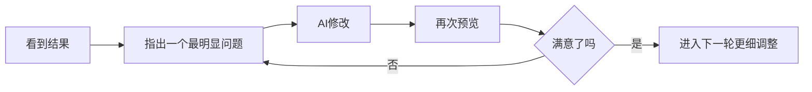

# 1.3 在平台里生成你的第一个版本，并完成三轮微调

## 现在，真的把它做出来

到了这一步，你手里已经有一批关于你自己的真实素材，也有一份填好的第一版需求模板。

接下来最重要的事情，就是把这些信息真正交给 AI 原型工具，让第一个版本先出现。

本节以 **秒哒** 为例。如果你当前使用的是其他支持自然语言生成页面的工具，操作逻辑也基本一致：打开平台，新建项目，粘贴需求，等待生成，然后进入预览。

## 第一次生成时，目标要非常克制

请记住：

> 第一次生成的目标不是“惊艳全场”，而是“先出来一个能看、能点、能聊的版本”。

所以这一步最重要的不是炫技，而是把范围先收住：页面能展示你是谁，页面里有数字分身聊天区，整体结构清楚，移动端至少不至于崩掉。

## 建议按这个顺序操作

先新建项目，给它一个简单清楚的名字，比如 `my-homepage` 或 `个人主页-v1`；然后把上一节填好的模板完整贴进去，别一边贴一边临时大改，先让第一版完整跑出来；接着耐心等第一轮输出结束，除非工具明显跑偏到完全不相关的方向，否则别半路频繁打断。等生成完成之后，再进入预览页。第一次预览时，只先看三件事：

1. 页面结构是否出来了
2. 个人信息是否基本正确
3. 数字分身聊天区是否已经出现

在秒哒里，粘贴完需求之后，通常不会立刻直接跳出最终页面。它往往会先帮你整理出一份更结构化的需求文档，确认应用名称、核心功能、页面结构和风格要求。这个步骤是正常的，不是工具卡住了，而是在帮你把刚才那段自然语言需求再收一层。

只要你看下来方向没有明显跑偏，就可以继续点击右下角的 `立即生成应用`。


你在这里主要看两件事：一是这份需求文档有没有把“你是谁、页面要有什么、数字分身要做什么”说对；二是右侧整理出来的风格要求有没有明显偏离你的预期。如果这两件事大体都对，就继续往下走，不要在这里过早抠细节。

## 第一次预览时，不要急着挑剔一切

很多人第一次看到结果，会立刻进入“这也不对、那也不对”的状态。

但此刻更有效的做法，是先判断三件事：它是不是已经是一个页面了，它是不是已经能表达“这是我”的方向了，它是不是已经具备继续迭代的基础。

下面这两张图，就是一个真实的第一页结果。每个人的素材、平台当时的生成状态、你给出的风格要求都不同，所以你的页面不一定长这样；但**第一页出现类似问题很正常**，不要因为它不完美，就误以为这条路走不通。


如果你仔细看这种第一版结果，通常会同时出现好消息和问题：好消息是，页面骨架已经出来了，首屏、项目区、聊天区、底部链接这些部分已经有了；问题也很明显，比如名字或信息可能抽错，聊天框的位置有点生硬，和页面右边缘贴得太近；`Q1`、`Q2`、`Q3` 这种按钮经常只是演示用的快捷问题，不一定真的已经接上大模型；有些链接、卡片或按钮看起来像能点，但其实还没有真正跳转。

这正是为什么我们一直强调：第一个版本的目标不是一步到位，而是先把一个能继续改的版本拉出来。

这里我先放到“第一页结果”这一步。后面讲到继续调整、微调和验收时，我还会把同一个案例的后续截图补在对应位置。你现在先抓住判断思路就够了：第一版先看骨架有没有出来、明显问题在哪里，不必等所有截图都放完再继续往下读。

如果答案大体是“是”，那你就成功了。

因为第 1 章的成功标准，从来都不是一步到位，而是：

**先把一个能继续改的版本拉出来。**

## 如果第一页就不是你想要的，也很正常

这不代表你失败了，也不代表工具不行。

更常见的情况是，你的描述还不够具体，你希望的风格还不够清楚，或者你还没有限制“先做第一版，不要加太多东西”。也可能是平台先给了你一版“能演示结构”的原型，所以出现了信息不准、占位交互还没接通、链接还不能跳这些很常见的第一页问题。

而这些，恰好说明：生成不是结束，迭代才是常态。

## 推荐的三轮微调法



### 第 1 轮：修明显错误

这一轮只处理最明显的问题，比如信息写错、区块缺失、布局严重不对，或者聊天入口没有正常出现。像前面截图里那种“名字写错了”“聊天框贴右边太近”“底部链接看起来能点但其实不能跳”“Q1/Q2/Q3 只是占位按钮”都属于这一轮该优先处理的问题。

你可以这样说：

```text
请先不要大改整个页面。

我先修几个明显问题：
1. 我的名字 / 中文名显示不对，请改成正确版本
2. 右侧聊天框离页面右边缘太近，请给它更自然的外边距和留白
3. 页面里的外部链接和联系方式请接成真实可点击跳转
4. Q1 / Q2 / Q3 如果只是演示按钮，请不要伪装成真实对话；要么把它们改成真正可触发聊天的问题，要么先移除

这一轮先只修这些明显问题，不要重做整体风格。
```

如果你现在最在意的是“chatbot 到底有没有真的连上模型”，也可以单独追问一句：

```text
请检查当前聊天区是否已经接入真实的大模型调用。
如果还只是演示或关键词匹配，请明确告诉我现在是哪种状态。
如果平台支持，请继续把它接成真实可用的 LLM 对话；如果这一步还缺配置，也请明确告诉我缺什么。
```

### 第 2 轮：调风格和内容

这一轮开始处理“它已经能用，但还不像我”的问题，比如风格太花或太素，颜色和你想的不一致，或者个人信息层次还不够清楚。像前面那个例子里，聊天框虽然已经出现了，但视觉上有点硬、和首屏不够协调，这就更适合放在这一轮继续调。

你可以这样说：

```text
现在结构已经基本对了。
接下来我只想调整整体风格：
- 让页面更简约、清爽
- 主色调改成深蓝和白色
- 不要增加新的复杂模块
请只做风格层面的修改。
```

### 第 3 轮：做小幅细化

这一轮再去处理那些“不是大问题，但做完会更顺眼”的细节，比如按钮文案是不是更自然，聊天区提示语是不是更清楚，头像和简介的排版是不是更舒服。

你可以这样说：

```text
页面整体已经接近我想要的效果了。
现在请只做小幅细化：
- 把聊天框的引导语改得更自然一点
- 让头像和简介区的间距更舒服
- 不要新增模块，也不要重做布局
```

## 两个很重要的微调原则

第一，一次只改一类问题。不要一口气说配色要改、布局要改、聊天逻辑要改，再顺便加个作品区。这样很容易让这轮修改范围失控。更稳的方式，就是一次只盯住一个主要目标。第二，尽量把改动边界说清。你可以直接说“只改这一部分”“先不要新增新模块”“保留现在的整体结构”。这会明显降低“修一处，动很多地方”的概率。

## 这一轮先修什么，后面几章再继续什么

如果你现在已经开始看到很多问题，不用急着在第 1 章一次全解掉。更稳的做法，是先区分“现在就该修”和“后面会系统处理”。

| 现在就修 | 后面几章继续处理 |
|------|------------------|
| 名字写错、信息抽错 | 更完整的界面和风格统一（第 3 章） |
| 明显的布局问题、区块缺失 | 内容模块怎么补更合理（第 4 章） |
| 链接按钮不能跳转 | 数字分身怎么更像你、更稳（第 5 章） |
| 聊天区只是占位、没有真实调用 | 上线与真实环境验证（第 6 章） |

也就是说，你完全可以现在继续追问秒哒，让它把链接接通、把明显错误修掉、把聊天区从“演示摆设”推进到“至少说明当前状态”；但更系统的 UI 润色，我们会在第 3 章展开；数字分身说明书、真实对话体验、API 和更稳定的回答，会在第 5 章继续处理。

## 如果三轮之后还不满意怎么办

如果你已经来回改了三轮，结果还是离预期很远，不要继续死磕细节。

更好的做法，是回头检查两件事：你的初始需求是不是太模糊了，以及你是不是把太多目标混在同一轮里了。

这时往往不是继续“更努力地调”，而是应该 **重写一版更清楚的需求描述**。

::: details 想深入一点？
如果你想系统理解多轮对话、调试心法和 AI 工作流，可以跳转到进阶版继续读：
- [第二章：AI 使用说明书](/Advanced/02-ai-tuning-guide/)
:::

---

[下一节：本章小结：第一轮验收与下一轮优化清单 →](../1.4-vibe-vs-spec/)
