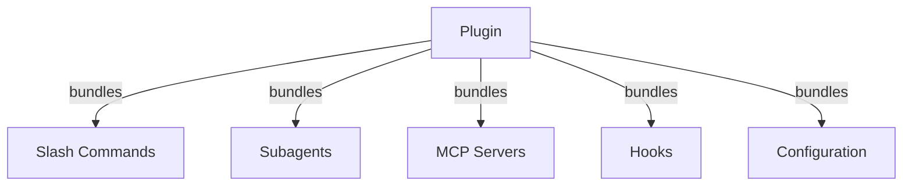
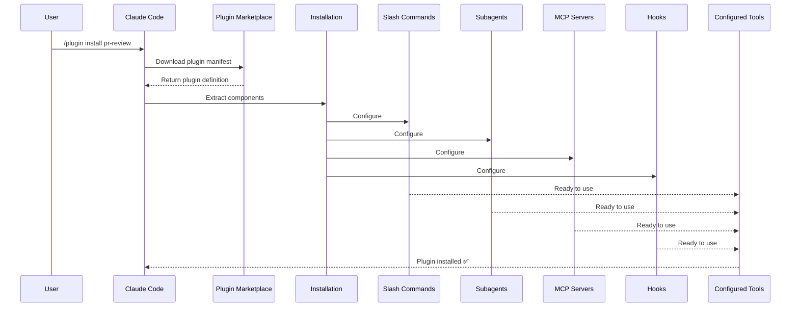
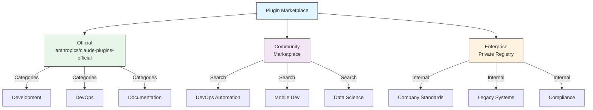
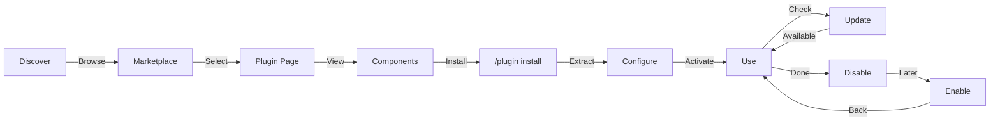
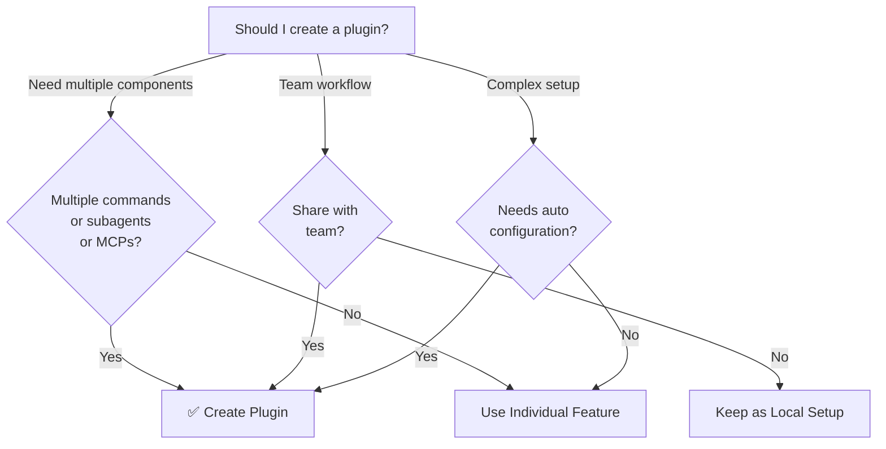

<picture>
  <source media="(prefers-color-scheme: dark)" srcset="../resources/logos/claude-howto-logo-dark.svg">
  
</picture>

# Claude Code Plugins

This folder contains complete plugin examples that bundle multiple Claude Code features into cohesive, installable packages.

## Overview

Claude Code Plugins are bundled collections of customizations (slash commands, subagents, MCP servers, and hooks) that install with a single command. They represent the highest-level extension mechanism—combining multiple features into cohesive, shareable packages.

## Plugin Architecture



## Plugin Loading Process



## Plugin Types & Distribution

| Type | Scope | Shared | Authority | Examples |
|------|-------|--------|-----------|----------|
| Official | Global | All users | Anthropic | PR Review, Security Guidance |
| Community | Public | All users | Community | DevOps, Data Science |
| Organization | Internal | Team members | Company | Internal standards, tools |
| Personal | Individual | Single user | Developer | Custom workflows |

## Plugin Definition Structure

Plugin manifest uses JSON format in `.claude-plugin/plugin.json`:

```json
{
  "name": "my-first-plugin",
  "description": "A greeting plugin",
  "version": "1.0.0",
  "author": {
    "name": "Your Name"
  },
  "homepage": "https://example.com",
  "repository": "https://github.com/user/repo",
  "license": "MIT"
}
```

## Plugin Structure Example

```
my-plugin/
├── .claude-plugin/
│   └── plugin.json       # Manifest (name, description, version, author)
├── commands/             # Skills as Markdown files
│   ├── task-1.md
│   ├── task-2.md
│   └── workflows/
├── agents/               # Custom agent definitions
│   ├── specialist-1.md
│   ├── specialist-2.md
│   └── configs/
├── skills/               # Agent Skills with SKILL.md files
│   ├── skill-1.md
│   └── skill-2.md
├── hooks/                # Event handlers in hooks.json
│   └── hooks.json
├── .mcp.json             # MCP server configurations
├── .lsp.json             # LSP server configurations
├── settings.json         # Default settings
├── templates/
│   └── issue-template.md
├── scripts/
│   ├── helper-1.sh
│   └── helper-2.py
├── docs/
│   ├── README.md
│   └── USAGE.md
└── tests/
    └── plugin.test.js
```

### LSP server configuration

Plugins can include Language Server Protocol (LSP) support for real-time code intelligence. LSP servers provide diagnostics, code navigation, and symbol information as you work.

**Configuration locations**:
- `.lsp.json` file in the plugin root directory
- Inline `lsp` key in `plugin.json`

#### Field reference

| Field | Required | Description |
|-------|----------|-------------|
| `command` | Yes | LSP server binary (must be in PATH) |
| `extensionToLanguage` | Yes | Maps file extensions to language IDs |
| `args` | No | Command-line arguments for the server |
| `transport` | No | Communication method: `stdio` (default) or `socket` |
| `env` | No | Environment variables for the server process |
| `initializationOptions` | No | Options sent during LSP initialization |
| `settings` | No | Workspace configuration passed to the server |
| `workspaceFolder` | No | Override the workspace folder path |
| `startupTimeout` | No | Maximum time (ms) to wait for server startup |
| `shutdownTimeout` | No | Maximum time (ms) for graceful shutdown |
| `restartOnCrash` | No | Automatically restart if the server crashes |
| `maxRestarts` | No | Maximum restart attempts before giving up |

#### Example configurations

**Go (gopls)**:

```json
{
  "go": {
    "command": "gopls",
    "args": ["serve"],
    "extensionToLanguage": {
      ".go": "go"
    }
  }
}
```

**Python (pyright)**:

```json
{
  "python": {
    "command": "pyright-langserver",
    "args": ["--stdio"],
    "extensionToLanguage": {
      ".py": "python",
      ".pyi": "python"
    }
  }
}
```

**TypeScript**:

```json
{
  "typescript": {
    "command": "typescript-language-server",
    "args": ["--stdio"],
    "extensionToLanguage": {
      ".ts": "typescript",
      ".tsx": "typescriptreact",
      ".js": "javascript",
      ".jsx": "javascriptreact"
    }
  }
}
```

#### Available LSP plugins

The official marketplace includes pre-configured LSP plugins:

| Plugin | Language | Server Binary | Install Command |
|--------|----------|---------------|----------------|
| `pyright-lsp` | Python | `pyright-langserver` | `pip install pyright` |
| `typescript-lsp` | TypeScript/JavaScript | `typescript-language-server` | `npm install -g typescript-language-server typescript` |
| `rust-lsp` | Rust | `rust-analyzer` | Install via `rustup component add rust-analyzer` |

#### LSP capabilities

Once configured, LSP servers provide:

- **Instant diagnostics** — errors and warnings appear immediately after edits
- **Code navigation** — go to definition, find references, implementations
- **Hover information** — type signatures and documentation on hover
- **Symbol listing** — browse symbols in the current file or workspace

## Plugin Options (v2.1.83+)

Plugins can declare user-configurable options in the manifest via `userConfig`. Values marked `sensitive: true` are stored in the system keychain rather than plain-text settings files:

```json
{
  "name": "my-plugin",
  "version": "1.0.0",
  "userConfig": {
    "apiKey": {
      "description": "API key for the service",
      "sensitive": true
    },
    "region": {
      "description": "Deployment region",
      "default": "us-east-1"
    }
  }
}
```

## Persistent Plugin Data (`${CLAUDE_PLUGIN_DATA}`) (v2.1.78+)

Plugins have access to a persistent state directory via the `${CLAUDE_PLUGIN_DATA}` environment variable. This directory is unique per plugin and survives across sessions, making it suitable for caches, databases, and other persistent state:

```json
{
  "hooks": {
    "PostToolUse": [
      {
        "command": "node ${CLAUDE_PLUGIN_DATA}/track-usage.js"
      }
    ]
  }
}
```

The directory is created automatically when the plugin is installed. Files stored here persist until the plugin is uninstalled.

## Inline Plugin via Settings (`source: 'settings'`) (v2.1.80+)

Plugins can be defined inline in settings files as marketplace entries using the `source: 'settings'` field. This allows embedding a plugin definition directly without requiring a separate repository or marketplace:

```json
{
  "pluginMarketplaces": [
    {
      "name": "inline-tools",
      "source": "settings",
      "plugins": [
        {
          "name": "quick-lint",
          "source": "./local-plugins/quick-lint"
        }
      ]
    }
  ]
}
```

## Plugin Settings

Plugins can ship a `settings.json` file to provide default configuration. This currently supports the `agent` key, which sets the main thread agent for the plugin:

```json
{
  "agent": "agents/specialist-1.md"
}
```

When a plugin includes `settings.json`, its defaults are applied on installation. Users can override these settings in their own project or user configuration.

## Standalone vs Plugin Approach

| Approach | Command Names | Configuration | Best For |
|----------|---------------|---|---|
| **Standalone** | `/hello` | Manual setup in CLAUDE.md | Personal, project-specific |
| **Plugins** | `/plugin-name:hello` | Automated via plugin.json | Sharing, distribution, team use |

Use **standalone slash commands** for quick personal workflows. Use **plugins** when you want to bundle multiple features, share with a team, or publish for distribution.

## Practical Examples

### Example 1: PR Review Plugin

**File:** `.claude-plugin/plugin.json`

```json
{
  "name": "pr-review",
  "version": "1.0.0",
  "description": "Complete PR review workflow with security, testing, and docs",
  "author": {
    "name": "Anthropic"
  },
  "repository": "https://github.com/your-org/pr-review",
  "license": "MIT"
}
```

**File:** `commands/review-pr.md`

```markdown
---
name: Review PR
description: Start comprehensive PR review with security and testing checks
---

# PR Review

This command initiates a complete pull request review including:

1. Security analysis
2. Test coverage verification
3. Documentation updates
4. Code quality checks
5. Performance impact assessment
```

**File:** `agents/security-reviewer.md`

```yaml
---
name: security-reviewer
description: Security-focused code review
tools: read, grep, diff
---

# Security Reviewer

Specializes in finding security vulnerabilities:
- Authentication/authorization issues
- Data exposure
- Injection attacks
- Secure configuration
```

**Installation:**

```bash
/plugin install pr-review

# Result:
# ✅ 3 slash commands installed
# ✅ 3 subagents configured
# ✅ 2 MCP servers connected
# ✅ 4 hooks registered
# ✅ Ready to use!
```

### Example 2: DevOps Plugin

**Components:**

```
devops-automation/
├── commands/
│   ├── deploy.md
│   ├── rollback.md
│   ├── status.md
│   └── incident.md
├── agents/
│   ├── deployment-specialist.md
│   ├── incident-commander.md
│   └── alert-analyzer.md
├── mcp/
│   ├── github-config.json
│   ├── kubernetes-config.json
│   └── prometheus-config.json
├── hooks/
│   ├── pre-deploy.js
│   ├── post-deploy.js
│   └── on-error.js
└── scripts/
    ├── deploy.sh
    ├── rollback.sh
    └── health-check.sh
```

### Example 3: Documentation Plugin

**Bundled Components:**

```
documentation/
├── commands/
│   ├── generate-api-docs.md
│   ├── generate-readme.md
│   ├── sync-docs.md
│   └── validate-docs.md
├── agents/
│   ├── api-documenter.md
│   ├── code-commentator.md
│   └── example-generator.md
├── mcp/
│   ├── github-docs-config.json
│   └── slack-announce-config.json
└── templates/
    ├── api-endpoint.md
    ├── function-docs.md
    └── adr-template.md
```

## Plugin Marketplace

The official Anthropic-managed plugin directory is `anthropics/claude-plugins-official`. Enterprise admins can also create private plugin marketplaces for internal distribution.



### Marketplace Configuration

Enterprise and advanced users can control marketplace behavior through settings:

| Setting | Description |
|---------|-------------|
| `extraKnownMarketplaces` | Add additional marketplace sources beyond the defaults |
| `strictKnownMarketplaces` | Control which marketplaces users are allowed to add |
| `deniedPlugins` | Admin-managed blocklist to prevent specific plugins from being installed |

### Additional Marketplace Features

- **Default git timeout**: Increased from 30s to 120s for large plugin repositories
- **Custom npm registries**: Plugins can specify custom npm registry URLs for dependency resolution
- **Version pinning**: Lock plugins to specific versions for reproducible environments

### Marketplace definition schema

Plugin marketplaces are defined in `.claude-plugin/marketplace.json`:

```json
{
  "name": "my-team-plugins",
  "owner": "my-org",
  "plugins": [
    {
      "name": "code-standards",
      "source": "./plugins/code-standards",
      "description": "Enforce team coding standards",
      "version": "1.2.0",
      "author": "platform-team"
    },
    {
      "name": "deploy-helper",
      "source": {
        "source": "github",
        "repo": "my-org/deploy-helper",
        "ref": "v2.0.0"
      },
      "description": "Deployment automation workflows"
    }
  ]
}
```

| Field | Required | Description |
|-------|----------|-------------|
| `name` | Yes | Marketplace name in kebab-case |
| `owner` | Yes | Organization or user who maintains the marketplace |
| `plugins` | Yes | Array of plugin entries |
| `plugins[].name` | Yes | Plugin name (kebab-case) |
| `plugins[].source` | Yes | Plugin source (path string or source object) |
| `plugins[].description` | No | Brief plugin description |
| `plugins[].version` | No | Semantic version string |
| `plugins[].author` | No | Plugin author name |

### Plugin source types

Plugins can be sourced from multiple locations:

| Source | Syntax | Example |
|--------|--------|---------|
| **Relative path** | String path | `"./plugins/my-plugin"` |
| **GitHub** | `{ "source": "github", "repo": "owner/repo" }` | `{ "source": "github", "repo": "acme/lint-plugin", "ref": "v1.0" }` |
| **Git URL** | `{ "source": "url", "url": "..." }` | `{ "source": "url", "url": "https://git.internal/plugin.git" }` |
| **Git subdirectory** | `{ "source": "git-subdir", "url": "...", "path": "..." }` | `{ "source": "git-subdir", "url": "https://github.com/org/monorepo.git", "path": "packages/plugin" }` |
| **npm** | `{ "source": "npm", "package": "..." }` | `{ "source": "npm", "package": "@acme/claude-plugin", "version": "^2.0" }` |
| **pip** | `{ "source": "pip", "package": "..." }` | `{ "source": "pip", "package": "claude-data-plugin", "version": ">=1.0" }` |

GitHub and git sources support optional `ref` (branch/tag) and `sha` (commit hash) fields for version pinning.

### Distribution methods

**GitHub (recommended)**:
```bash
# Users add your marketplace
/plugin marketplace add owner/repo-name
```

**Other git services** (full URL required):
```bash
/plugin marketplace add https://gitlab.com/org/marketplace-repo.git
```

**Private repositories**: Supported via git credential helpers or environment tokens. Users must have read access to the repository.

**Official marketplace submission**: Submit plugins to the Anthropic-curated marketplace for broader distribution.

### Strict mode

Control how marketplace definitions interact with local `plugin.json` files:

| Setting | Behavior |
|---------|----------|
| `strict: true` (default) | Local `plugin.json` is authoritative; marketplace entry supplements it |
| `strict: false` | Marketplace entry is the entire plugin definition |

**Organization restrictions** with `strictKnownMarketplaces`:

| Value | Effect |
|-------|--------|
| Not set | No restrictions — users can add any marketplace |
| Empty array `[]` | Lockdown — no marketplaces allowed |
| Array of patterns | Allowlist — only matching marketplaces can be added |

```json
{
  "strictKnownMarketplaces": [
    "my-org/*",
    "github.com/trusted-vendor/*"
  ]
}
```

> **Warning**: In strict mode with `strictKnownMarketplaces`, users can only install plugins from allowlisted marketplaces. This is useful for enterprise environments requiring controlled plugin distribution.

## Plugin Installation & Lifecycle



## Plugin Features Comparison

| Feature | Slash Command | Skill | Subagent | Plugin |
|---------|---------------|-------|----------|--------|
| **Installation** | Manual copy | Manual copy | Manual config | One command |
| **Setup Time** | 5 minutes | 10 minutes | 15 minutes | 2 minutes |
| **Bundling** | Single file | Single file | Single file | Multiple |
| **Versioning** | Manual | Manual | Manual | Automatic |
| **Team Sharing** | Copy file | Copy file | Copy file | Install ID |
| **Updates** | Manual | Manual | Manual | Auto-available |
| **Dependencies** | None | None | None | May include |
| **Marketplace** | No | No | No | Yes |
| **Distribution** | Repository | Repository | Repository | Marketplace |

## Plugin CLI Commands

All plugin operations are available as CLI commands:

```bash
claude plugin install <name>@<marketplace>   # Install from a marketplace
claude plugin uninstall <name>               # Remove a plugin
claude plugin list                           # List installed plugins
claude plugin enable <name>                  # Enable a disabled plugin
claude plugin disable <name>                 # Disable a plugin
claude plugin validate                       # Validate plugin structure
```

## Installation Methods

### From Marketplace
```bash
/plugin install plugin-name
# or from CLI:
claude plugin install plugin-name@marketplace-name
```

### Enable / Disable (with auto-detected scope)
```bash
/plugin enable plugin-name
/plugin disable plugin-name
```

### Local Plugin (for development)
```bash
# CLI flag for local testing (repeatable for multiple plugins)
claude --plugin-dir ./path/to/plugin
claude --plugin-dir ./plugin-a --plugin-dir ./plugin-b
```

### From Git Repository
```bash
/plugin install github:username/repo
```

## When to Create a Plugin



### Plugin Use Cases

| Use Case | Recommendation | Why |
|----------|-----------------|-----|
| **Team Onboarding** | ✅ Use Plugin | Instant setup, all configurations |
| **Framework Setup** | ✅ Use Plugin | Bundles framework-specific commands |
| **Enterprise Standards** | ✅ Use Plugin | Central distribution, version control |
| **Quick Task Automation** | ❌ Use Command | Overkill complexity |
| **Single Domain Expertise** | ❌ Use Skill | Too heavy, use skill instead |
| **Specialized Analysis** | ❌ Use Subagent | Create manually or use skill |
| **Live Data Access** | ❌ Use MCP | Standalone, don't bundle |

## Testing a Plugin

Before publishing, test your plugin locally using the `--plugin-dir` CLI flag (repeatable for multiple plugins):

```bash
claude --plugin-dir ./my-plugin
claude --plugin-dir ./my-plugin --plugin-dir ./another-plugin
```

This launches Claude Code with your plugin loaded, allowing you to:
- Verify all slash commands are available
- Test subagents and agents function correctly
- Confirm MCP servers connect properly
- Validate hook execution
- Check LSP server configurations
- Check for any configuration errors

## Hot-Reload

Plugins support hot-reload during development. When you modify plugin files, Claude Code can detect changes automatically. You can also force a reload with:

```bash
/reload-plugins
```

This re-reads all plugin manifests, commands, agents, skills, hooks, and MCP/LSP configurations without restarting the session.

## Managed Settings for Plugins

Administrators can control plugin behavior across an organization using managed settings:

| Setting | Description |
|---------|-------------|
| `enabledPlugins` | Allowlist of plugins that are enabled by default |
| `deniedPlugins` | Blocklist of plugins that cannot be installed |
| `extraKnownMarketplaces` | Add additional marketplace sources beyond the defaults |
| `strictKnownMarketplaces` | Restrict which marketplaces users are allowed to add |
| `allowedChannelPlugins` | Control which plugins are permitted per release channel |

These settings can be applied at the organization level via managed configuration files and take precedence over user-level settings.

## Plugin Security

Plugin subagents run in a restricted sandbox. The following frontmatter keys are **not allowed** in plugin subagent definitions:

- `hooks` -- Subagents cannot register event handlers
- `mcpServers` -- Subagents cannot configure MCP servers
- `permissionMode` -- Subagents cannot override the permission model

This ensures that plugins cannot escalate privileges or modify the host environment beyond their declared scope.

## Publishing a Plugin

**Steps to publish:**

1. Create plugin structure with all components
2. Write `.claude-plugin/plugin.json` manifest
3. Create `README.md` with documentation
4. Test locally with `claude --plugin-dir ./my-plugin`
5. Submit to plugin marketplace
6. Get reviewed and approved
7. Published on marketplace
8. Users can install with one command

**Example submission:**

```markdown
# PR Review Plugin

## Description
Complete PR review workflow with security, testing, and documentation checks.

## What's Included
- 3 slash commands for different review types
- 3 specialized subagents
- GitHub and CodeQL MCP integration
- Automated security scanning hooks

## Installation
```bash
/plugin install pr-review
```

## Features
✅ Security analysis
✅ Test coverage checking
✅ Documentation verification
✅ Code quality assessment
✅ Performance impact analysis

## Usage
```bash
/review-pr
/check-security
/check-tests
```

## Requirements
- Claude Code 1.0+
- GitHub access
- CodeQL (optional)
```

## Plugin vs Manual Configuration

**Manual Setup (2+ hours):**
- Install slash commands one by one
- Create subagents individually
- Configure MCPs separately
- Set up hooks manually
- Document everything
- Share with team (hope they configure correctly)

**With Plugin (2 minutes):**
```bash
/plugin install pr-review
# ✅ Everything installed and configured
# ✅ Ready to use immediately
# ✅ Team can reproduce exact setup
```

## Best Practices

### Do's ✅
- Use clear, descriptive plugin names
- Include comprehensive README
- Version your plugin properly (semver)
- Test all components together
- Document requirements clearly
- Provide usage examples
- Include error handling
- Tag appropriately for discovery
- Maintain backward compatibility
- Keep plugins focused and cohesive
- Include comprehensive tests
- Document all dependencies

### Don'ts ❌
- Don't bundle unrelated features
- Don't hardcode credentials
- Don't skip testing
- Don't forget documentation
- Don't create redundant plugins
- Don't ignore versioning
- Don't overcomplicate component dependencies
- Don't forget to handle errors gracefully

## Installation Instructions

### Installing from Marketplace

1. **Browse available plugins:**
   ```bash
   /plugin list
   ```

2. **View plugin details:**
   ```bash
   /plugin info plugin-name
   ```

3. **Install a plugin:**
   ```bash
   /plugin install plugin-name
   ```

### Installing from Local Path

```bash
/plugin install ./path/to/plugin-directory
```

### Installing from GitHub

```bash
/plugin install github:username/repo
```

### Listing Installed Plugins

```bash
/plugin list --installed
```

### Updating a Plugin

```bash
/plugin update plugin-name
```

### Disabling/Enabling a Plugin

```bash
# Temporarily disable
/plugin disable plugin-name

# Re-enable
/plugin enable plugin-name
```

### Uninstalling a Plugin

```bash
/plugin uninstall plugin-name
```

## Related Concepts

The following Claude Code features work together with plugins:

- **[Slash Commands](../01-slash-commands/)** - Individual commands bundled in plugins
- **[Memory](../02-memory/)** - Persistent context for plugins
- **[Skills](../03-skills/)** - Domain expertise that can be wrapped into plugins
- **[Subagents](../04-subagents/)** - Specialized agents included as plugin components
- **[MCP Servers](../05-mcp/)** - Model Context Protocol integrations bundled in plugins
- **[Hooks](../06-hooks/)** - Event handlers that trigger plugin workflows

## Complete Example Workflow

### PR Review Plugin Full Workflow

```
1. User: /review-pr

2. Plugin executes:
   ├── pre-review.js hook validates git repo
   ├── GitHub MCP fetches PR data
   ├── security-reviewer subagent analyzes security
   ├── test-checker subagent verifies coverage
   └── performance-analyzer subagent checks performance

3. Results synthesized and presented:
   ✅ Security: No critical issues
   ⚠️  Testing: Coverage 65% (recommend 80%+)
   ✅ Performance: No significant impact
   📝 12 recommendations provided
```

## Troubleshooting

### Plugin Won't Install
- Check Claude Code version compatibility: `/version`
- Verify `plugin.json` syntax with a JSON validator
- Check internet connection (for remote plugins)
- Review permissions: `ls -la plugin/`

### Components Not Loading
- Verify paths in `plugin.json` match actual directory structure
- Check file permissions: `chmod +x scripts/`
- Review component file syntax
- Check logs: `/plugin debug plugin-name`

### MCP Connection Failed
- Verify environment variables are set correctly
- Check MCP server installation and health
- Test MCP connection independently with `/mcp test`
- Review MCP configuration in `mcp/` directory

### Commands Not Available After Install
- Ensure plugin was installed successfully: `/plugin list --installed`
- Check if plugin is enabled: `/plugin status plugin-name`
- Restart Claude Code: `exit` and reopen
- Check for naming conflicts with existing commands

### Hook Execution Issues
- Verify hook files have correct permissions
- Check hook syntax and event names
- Review hook logs for error details
- Test hooks manually if possible

## Additional Resources

- [Official Plugins Documentation](https://code.claude.com/docs/en/plugins)
- [Discover Plugins](https://code.claude.com/docs/en/discover-plugins)
- [Plugin Marketplaces](https://code.claude.com/docs/en/plugin-marketplaces)
- [Plugins Reference](https://code.claude.com/docs/en/plugins-reference)
- [MCP Server Reference](https://modelcontextprotocol.io/)
- [Subagent Configuration Guide](../04-subagents/README.md)
- [Hook System Reference](../06-hooks/README.md)
