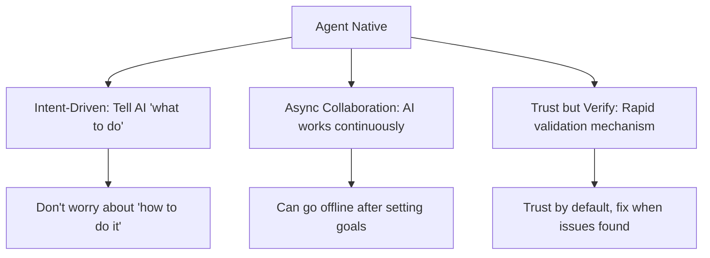
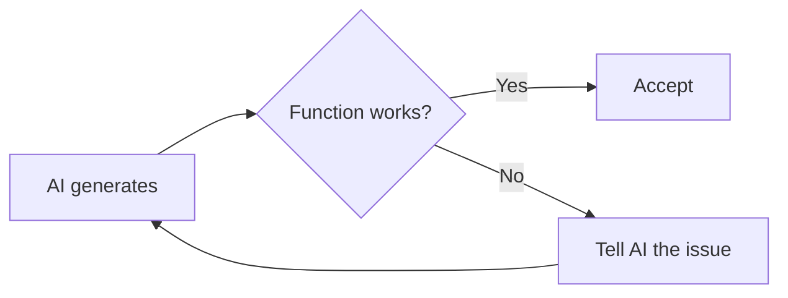
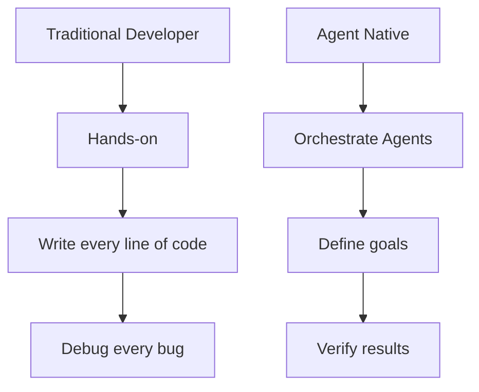
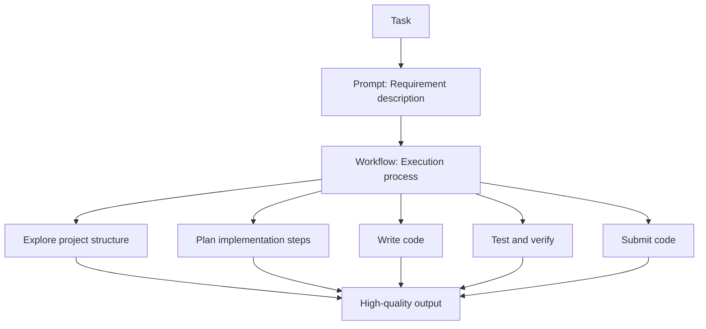
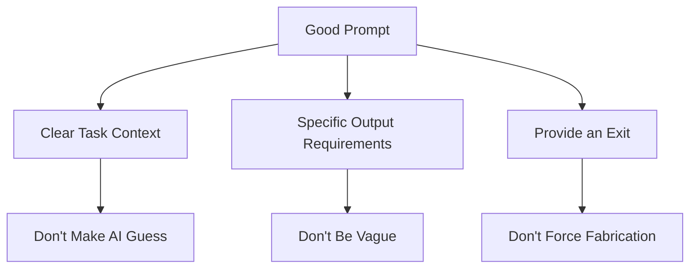
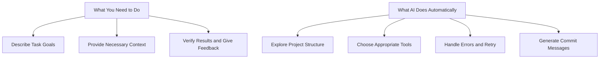
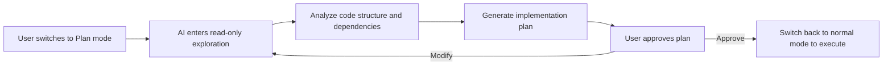
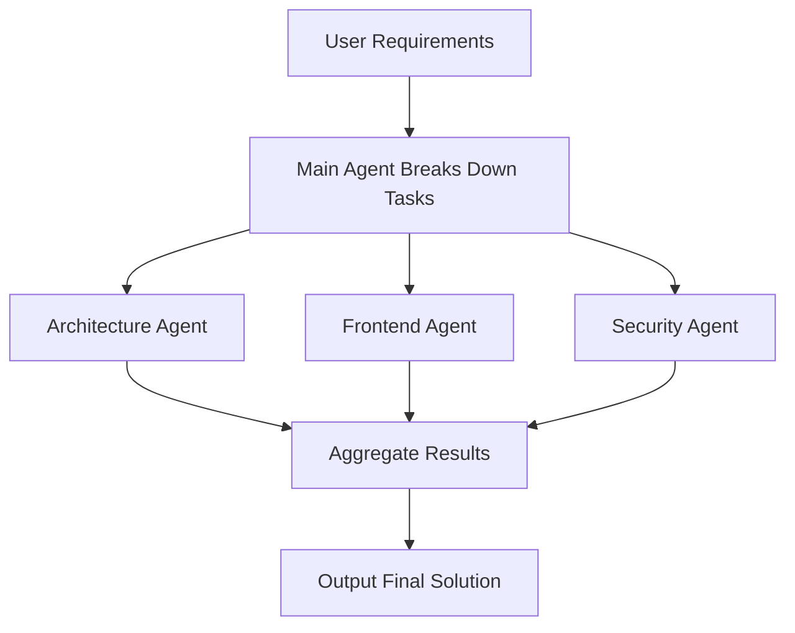
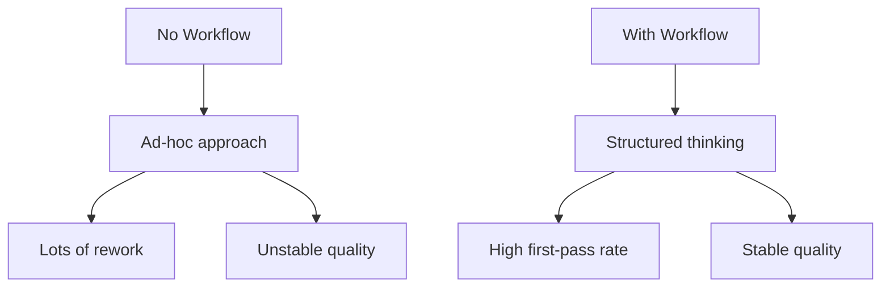

# 2.2 VibeCoding Workflow

> **After reading this section, you will:**
>
> - Master the five-step VibeCoding workflow: Explore → Plan → Execute → Verify → Submit
> - Understand Agent Native development mindset, learning to shift from "how to do it" to "what to build" product-oriented thinking
> - Learn to write high-quality prompts: describe tasks directly, provide context, give specific constraints
> - Master core Claude Code interactions including permission modes, slash commands, and checkpoint features
> - Understand multi-Agent parallel collaboration mechanisms, learning to leverage AI automation to boost development efficiency

> The "Workflow (tool flow)" mentioned in the preface is the core of Vibecoding, as well as the standard VibeCoding development process.

::: tip Community “asset library” reading
The Chinese community repo [**vibe-coding-cn**](https://github.com/2025Emma/vibe-coding-cn) organizes many prompts, Skills, and document layouts into browsable folders (layered prompts, memory-bank-style doc skeletons, etc.). It is meant to be **cherry-picked alongside** this book: the book walks a full-stack path; that repo emphasizes **reusable phrasing and templates**.

- **Full README mirrored on this site**: [Vibe Coding Guide (community mirror)](/VibeCodingCN/) → [full README (Chinese)](/VibeCodingCN/02-readme-full) (MIT, attribution at top)
- **How to use it**: [Appendix H: Community Vibe Coding Resources](/en/Basic/99-appendix/h-community-vibe-coding-resources)
:::

## Prerequisites

::: tip What is Claude Code

Claude Code is an AI command-line tool that can directly read project files, execute commands, automatically modify code, and complete tasks.

**Official docs**: [Overview](https://code.claude.com/docs/en/overview) · [Quickstart](https://code.claude.com/docs/en/quickstart) · [Common workflows](https://code.claude.com/docs/en/common-workflows) — or switch to **`/docs/zh-CN/...`** for Chinese.
:::

::: tip What is a Workflow

A workflow is a standardized process for completing tasks. AI development workflows include exploration, planning, coding, submission, and other stages.
:::

::: tip What is a Prompt

A prompt is a text instruction sent to AI describing what you want it to accomplish. **Good prompts are part of the workflow**.
:::
::: details Click to view Agent Native Development Mindset


**Agent Native** = AI Agent-centric development mindset

In traditional development, AI is an assistant (Copilot); in Agent Native, AI is an autonomous executor (Autopilot).


#### Traditional vs Agent Native

| Dimension | Traditional AI-Assisted Development | Agent Native Development |
|-----------|-------------------------------------|--------------------------|
| **Core Role** | Human writes code, AI helps | AI takes the lead, code is AI's implementation detail |
| **Working Mode** | AI is Copilot | AI is Autopilot |
| **Interaction Pattern** | Human writes Prompt to direct AI | AI proactively asks questions, plans, executes |
| **Output Form** | AI generates code snippets, human integrates | AI autonomously completes full tasks |
| **Your Focus** | How to write code | What product to build |

### VibeCoding's Core Philosophy: You're the Director, AI is the Actor

The core of VibeCoding isn't "letting AI write code for you," but "you steering AI to write code." This distinction is crucial. If you treat AI as a replacement, you'll gradually lose control over your product, eventually creating something technically perfect but productively mediocre. The truly powerful approach is "release and control": release means letting AI freely explore among massive technical solutions, generating multiple implementation paths, helping you see possibilities you couldn't see before; control means making directional decisions at key points, calling the shots, and taking responsibility.

Your work's value lies not in how much code you write or how new your tech stack is, but in the product direction you choose, the architectural judgments you make, and the responsibility you're willing to bear. AI can help you write ten thousand lines of code, but only you can decide what problem those ten thousand lines should solve. This is why PRDs are so important—the PRD is your "control" over AI. Without a PRD, AI is a runaway horse that may run fast but in the wrong direction; with a PRD, AI is an obedient executor, with every step under your control.

### AI-Human Division of Labor: Prediction vs Judgment

In the VibeCoding workflow, understanding the division between AI and humans is essential. AI handles "prediction"—based on massive training data, it generates multiple code solutions, provides architectural suggestions, and recommends technology choices. These solutions are typically the highest-probability, best-practice-compliant options. But AI doesn't know your business context, understand your user needs, or take responsibility for product direction.

This is where your value lies. You handle "judgment"—choosing the most suitable option from AI's multiple proposals, deciding whether to accept certain code based on your business understanding, and determining product direction based on your user insight. This isn't because AI lacks capability, but because the division is inherently this way: AI excels at prediction based on data, you excel at judgment based on understanding.

Permission modes (Default/Plan/Accept Edits) essentially regulate the "decoupling degree of prediction and judgment." In Default mode, AI's read-only exploration runs automatically, but code modifications require your judgment; in Plan mode, AI can only explore and analyze, all judgments are yours; in Accept Edits mode, AI can autonomously run commands and tests, but code modifications still require your judgment. Which mode to choose depends on your familiarity with the current task and risk tolerance.

#### Three Principles of Agent Native



**1. Intent-Driven**

Tell AI the goal, let it decide the implementation:

```bash
❌ Traditional mindset:
"Help me write a function that takes an array parameter,
uses a for loop to iterate, pushes elements greater than 10
to a new array..."

✅ Agent Native:
"Filter elements greater than 10 from the array, return new array"
```

**2. Async Collaboration**

AI can work while you sleep:

```bash
# You set the goal, AI executes autonomously
"Implement user comment feature, including:
1. Database schema (Comment model)
2. CRUD API
3. Frontend comment form
4. Comment list display

Let me know when done, I'll be busy with other things."
```

**3. Trust but Verify**

Don't check AI's code line by line, instead:



**Verification methods**:

- Functional testing: Run it and see if it works
- Type checking: Does `tsc` report errors?
- Code review: Only look at critical logic, not implementation details

#### From Developer to Orchestrator

In the Agent Native era, your role transforms:



| Traditional Developer | Agent Native Orchestrator |
|-----------------------|---------------------------|
| Hand-write code | Describe requirements |
| Fix one by one | Provide feedback |
| Focus on syntax | Focus on product |
| Is a craftsman | Is a commander |

**Remember**: Code is implementation detail, product is the goal. Agent Native frees you from "how to do it" to focus on "what to do."

:::

## Core Concepts

### Vibecoding's Core Philosophy

```
Vibecoding = Prompt + Workflow
```

**Prompt tells AI what to do**
**Workflow determines how to do it**





### Core Principles of Prompts

AI is a powerful programming assistant that understands technical terminology, is familiar with various frameworks, and can quickly analyze code.

**The key to communication is: direct, specific, contextual.**

❌ **Beating around the bush**:

```
"You are a senior full-stack engineer, proficient in various tech stacks..."
```

→ AI doesn't need roleplay, it knows what it can do

✅ **Get straight to the point**:

```
"Detect type safety issues in this React component"
```

→ One sentence clarifies what needs to be done

❌ **Vague description**:

```
"Help me optimize the code"
```

→ AI doesn't know what direction to optimize

✅ **Specific requirements**:

```
"Optimize login page loading performance:
1. Add image lazy loading
2. Defer loading non-critical resources
3. Use Next.js dynamic imports"
```

→ Clear optimization goals and implementation methods## Prompt Principles

### Characteristics of Good Prompts



### Prompt Comparison: Poor vs. Recommended

| Type | Poor | Recommended |
|------|------|-------------|
| **Role Playing** | "You are a full-stack engineer with 20 years of experience, proficient in React, Vue, Angular, Node.js, Python..." | State the task directly: "Implement user login functionality" |
| **Vague Instructions** | "Help me optimize the code" | "Optimize login page loading performance: add image lazy loading, defer non-critical resources" |
| **No Boundaries** | "Write a complete e-commerce system" | "Implement user comment feature, including: comment form, list display, data persistence" |
| **Forced Requirements** | "You must give the correct answer, can't say you don't know" | "If unsure, explicitly say 'I'm not sure' instead of making up an answer" |
| **Specific Task** | "Help me write a login feature" | "Implement user login: username + password login, using Next.js 16 App Router, Drizzle ORM + PostgreSQL, include form validation and error handling" |
| **Provide Context** | "Fix this bug" | "Fix bug: file app/login/page.tsx, issue: user doesn't redirect to homepage after login, expected: redirect to /dashboard" |
| **Specific Instructions** | "Add tests" | "Write test cases for app/login/page.tsx, framework: Playwright, cover scenarios: wrong password, account doesn't exist, network error" |

**Core Principles**:

- Don't make AI guess → Provide clear context
- Don't be vague → Give specific requirements
- Don't force fabrication → Give AI an "uncertain" exit

### Let AI Ask Questions Repeatedly

```
"I want to develop a task management app.
Please ask me questions repeatedly until you fully understand my requirements.
Don't guess, just ask."
```

### Prompt Templates

#### Code Generation Template

```
"Implement [Feature Name]

Tech Stack:
- Next.js [version]
- TypeScript
- Drizzle ORM
- [Other technologies]

Requirements:
1. [Specific requirement 1]
2. [Specific requirement 2]
3. [Specific requirement 3]

Notes:
- Follow existing project code style
- Don't introduce new dependencies unless necessary
- Include error handling"
```

#### Bug Fix Template

```
"Fix Bug

File path: [full path]
Error message:
[complete error log]

Current code:
[relevant code snippet]

Expected behavior: [description]
Actual behavior: [description]

Please analyze the cause and provide a fix"
```

## Standard Workflow

### AI's Automation Capabilities

Before starting the workflow, remember: **AI can automate many tasks**.

::: info Claude Code vs. Other AI Tools

**Key Differences**:

| Feature | Claude Code | Cursor/Windsurf | ChatGPT Web |
|---------|-------------|-----------------|-------------|
| **Project Context** | ✅ Auto-reads entire project | ✅ Auto-reads | ❌ Manual paste |
| **Command Execution** | ✅ Direct bash execution | ✅ Integrated terminal | ❌ Copy to terminal |
| **File Editing** | ✅ Auto-edit multiple files | ✅ Multi-file editing | ⚠️ Copy one by one |
| **Version Control** | ✅ Auto-commit | ✅ Git integration | ❌ Manual operation |
| **Workflow** | ✅ Standardized process | ⚠️ Needs manual | ❌ Casual conversation |

**Why Claude Code is Better for Vibecoding**:

1. CLI-native: Command line is the developer's native environment
2. High automation: Reduces manual operations
3. Standardized process: Explore → Plan → Implement → Verify → Commit
4. Complete context: Understands entire project structure
:::



**AI's Automation Capabilities**:

- ✅ Auto-explore project structure (you don't need to tell it which files to look at)
- ✅ Auto-choose appropriate tools (Read, Edit, Bash)
- ✅ Auto-handle errors (retries or switches approach on failure)
- ✅ Auto-generate commit messages (based on changes)
- ✅ Auto-identify dependencies (knows which files are affected by changes)

**What You Need to Do**:

- Clearly describe task goals
- Provide necessary context
- Verify results and give feedback

**What You Don't Need to Do**:

- ❌ Specify specific steps ("first read file A, then read file B")
- ❌ Tell it which tool to use ("use the Read tool to read")
- ❌ Manually combine commands ("run git add then git commit")
- ❌ Manually handle errors ("retry if it fails")

### Permission Modes

::: tip Scenario: Why You Need to Switch Modes

You're debugging a feature, and every time you run tests you have to click "confirm"—5 times in one minute. Very inefficient.

You try pressing **Shift+Tab** to switch to **Accept Edits mode**, test commands execute automatically, and it only asks when modifying code. Instantly peaceful.

This is the purpose of **permission modes**: balancing efficiency and safety in different scenarios.

:::

#### Three Permission Modes

| Mode | Shortcut | Characteristics | When to Use |
|------|----------|-----------------|-------------|
| **Default** | Shift+Tab | Read auto, write ask | Daily development (recommended) |
| **Plan** | Shift+Tab | Read-only, no write | Want to understand code first, afraid of accidental changes |
| **Accept Edits** | Shift+Tab | Write needs confirm, others auto | Frequent testing/running commands |

**Quick Decision**:

- Unsure → Default
- Just want to read code → Plan
- Frequently running commands → Accept Edits

**Try the interactive simulation to feel the difference between modes:**

<PermissionModeSwitcher />

#### Default Mode (Recommended)

Read-only operations (reading files, searching code, checking status, listing files) are auto-approved; modification operations (editing files, deleting files, running commands, network requests, Git push) require confirmation.

**Permission Popup Options**:

- **Yes**: Approve this operation
- **Yes, don't ask again for this tool**: Approve this and don't ask for similar operations later
- **No, and tell AI what to do differently**: Reject and tell AI to try a different approach

#### Plan Mode (Code Review)

Only allows read-only operations; all modification operations are blocked.

**Applicable Scenarios**:

- Code review
- Understanding codebase structure
- Exploratory analysis

::: tip Plan Mode Deep Dive

Plan mode isn't just "read-only"—it's Claude Code's built-in **structured planning process**, letting AI fully understand the codebase before acting.

**Internal Mechanism**:



When you switch to Plan mode, Claude Code will:

1. **Restrict to read-only tools**—can only read files, search code, browse directories, cannot edit or execute commands
2. **Deeply explore the codebase**—automatically traverse relevant files, understand architecture and dependencies
3. **Output structured plan**—includes which files to modify, what to change in each file, execution order

**When to Use Plan Mode**:

| Scenario | Recommended | Reason |
|----------|-------------|--------|
| New feature involves 3+ files | ✅ Strongly recommended | Avoid discovering omissions halfway through |
| Large-scale refactoring | ✅ Strongly recommended | Needs global perspective |
| Unfamiliar codebase | ✅ Recommended | Understand before acting |
| Architecture decisions (selection) | ✅ Recommended | Needs comparative analysis |
| Single-file bug fix | ❌ Not needed | Just fix it directly |
| Simple copy changes | ❌ Not needed | Overly bureaucratic |

**Real-world Example**: Migrating auth module from Session to JWT

```
# First switch to Plan mode (Shift+Tab to toggle)
"Help me migrate user auth from express-session to JWT"

# AI will automatically:
# 1. Read current auth-related files
# 2. Analyze where session is used
# 3. Output migration plan (which files to change, what to change, order)
# 4. Wait for your confirmation, then switch back to normal mode to execute
```

**Plan Mode vs. Verbally Saying "Plan First"**:

Verbally saying "help me plan first" can also make AI output a plan, but Plan mode is fundamentally different:

- **Tool-level restriction**: In Plan mode, AI can only use read-only tools, ensuring the planning phase focuses on analysis
- **Structured approval**: After the plan is output, you approve it, then switch back to normal mode to execute
- **More thorough exploration**: Because it can't write, AI spends more tokens understanding the code

:::

Edit operations need confirmation, other operations are auto-approved.

```bash
# Example behavior
"Read config file"
"Run tests"
# AI executes directly (non-edit operations)

"Modify function signature"
"Delete this file"
# AI will ask (edit operations need confirmation)
```

**Applicable Scenarios**:

- Need to frequently run commands/tests
- Need to be careful with file modifications
- Highly trusted automated workflow

#### Mode Switching# Keyboard Shortcuts

Shift+Tab  # Cycles between three modes


### Common Interactive Commands

In Claude Code, commands starting with `/` are called slash commands, used to quickly execute specific actions:

| Command | Function | Use Case |
|---------|----------|----------|
| **/clear** | Clear conversation context | When starting a new task |
| **/model** | Switch AI model | Switch to Opus when more capability is needed |
| **/status** | Check usage quota and billing | Check remaining quota |
| **/config** | Open configuration interface | Modify settings |
| **/resume** | Resume recent session | Continue previous work after restart |
| **/rewind** | Revert to previous checkpoint | Roll back when code changes go wrong |
| **/agents** | Manage Agents | Create/view custom Agents |
| **/init** | Generate CLAUDE.md template | Quick setup for new projects |
| **/compact** | Compress conversation context | Trim when context is too large |
| **/export** | Export conversation log | Share or save conversation |
| **/statusline** | Customize status bar display | Hide/show status information |
| **/vim** | Enable Vim key bindings | For users familiar with Vim |

**Common Scenarios**:

```bash
# Clear context when starting a new task
/clear

# Check remaining quota
/status

# Switch to more powerful model
/model opus

# Revert to previous state
/rewind
```

### CLI Commands and Launch Options

::: details Basic Commands (Required Reading)

| Command | Description | Example |
|---------|-------------|---------|
| **claude** | Start interactive REPL | `claude` |
| **claude "query"** | Start REPL with initial prompt | `claude "explain this project"` |
| **claude -p "query"** | Exit after query (headless mode) | `claude -p "check for type errors"` |
| **claude -c** | Continue previous conversation | `claude -c` |
| **claude -r "id"** | Resume specified session | `claude -r "abc123"` |
| **claude --continue** | Load most recent conversation | `claude --continue` |
| **claude --resume** | Show session selector | `claude --resume` |

:::

::: details Common Launch Options

| Option | Function | Example |
|--------|----------|---------|
| **-p "query"** | Execute query and exit | `claude -p "run tests"` |
| **--model** | Specify model | `claude --model opus` |
| **--permission-mode** | Set permission mode | `claude --permission-mode plan` |
| **--add-dir** | Add working directory | `claude --add-dir ../shared` |

:::

::: details Keyboard Shortcuts and Input Control (Required Reading)

| Shortcut | Function | Context |
|----------|----------|---------|
| **Ctrl+C** | Cancel current input or generation | Standard interrupt |
| **Ctrl+D** | Exit session | EOF signal |
| **Ctrl+L** | Clear terminal screen | Preserves conversation history |
| **Ctrl+R** | Reverse search command history | Search previous commands |
| **Esc+Esc** | Revert code/conversation | Return to previous state |
| **Tab** | Toggle extended thinking | Turn thinking mode on/off |
| **Shift+Tab** | Toggle permission mode | Cycle through permission modes |

**Multi-line Input Methods**:

| Shortcut | Context |
|----------|---------|
| **\ + Enter** | Works in all terminals |
| **Option+Enter** (macOS) | macOS default setting |
| **Shift+Enter** | Available after configuration |

**Quick Command Prefixes**:

| Prefix | Function | Example |
|--------|----------|---------|
| **#** | Memory shortcut, adds to CLAUDE.md | `# add project context` |
| **/** | Slash command | `/clear` |
| **!** | Bash mode, run command directly | `! npm test` |
| **@** | File path reference | `@src/app/page.tsx` |

:::

::: details Advanced: Advanced CLI Flags

**Complete List of CLI Flags**:

| Flag | Description | Example |
|------|-------------|---------|
| `--add-dir` | Add additional working directory | `claude --add-dir ../apps` |
| `--agents` | Define Agent in JSON format | `claude --agents '{...}'` |
| `--allowedTools` | Allowed tools list | `claude --allowedTools "Read,Bash"` |
| `--disallowedTools` | Disallowed tools list | `claude --disallowedTools "Edit"` |
| `--system-prompt` | Replace entire system prompt | `claude --system-prompt "..."` |
| `--system-prompt-file` | Load system prompt from file | `claude -p --system-prompt-file ./prompt.txt` |
| `--append-system-prompt` | Append to default prompt | `claude --append-system-prompt "..."` |
| `--output-format` | Output format (text/json/stream-json) | `claude -p --output-format json` |
| `--input-format` | Input format (text/stream-json) | `claude -p --input-format stream-json` |
| `--verbose` | Enable verbose logging | `claude --verbose` |
| `--max-turns` | Limit number of turns | `claude -p --max-turns 3` |
| `--dangerously-skip-permissions` | Skip permission prompts | `claude --dangerously-skip-permissions` |

**System Prompt Flag Differences**:

| Flag | Behavior | Mode | Use Case |
|------|----------|------|----------|
| `--system-prompt` | **Replaces** entire default prompt | Interactive + Print | Full control over behavior |
| `--system-prompt-file` | **Replaces** with file contents | Print only | Load from file |
| `--append-system-prompt` | **Appends** to default prompt | Interactive + Print | Add specific instructions |

:::

::: details Advanced: Vim Mode

Enable with `/vim` or configure permanently via `/config`.

**Mode Switching**:

| Command | Action | From Mode |
|---------|--------|-----------|
| `Esc` | Enter NORMAL mode | INSERT |
| `i` | Insert before cursor | NORMAL |
| `a` | Insert after cursor | NORMAL |
| `o` | Open line below | NORMAL |

**Navigation (NORMAL Mode)**:

| Command | Action |
|---------|--------|
| `h/j/k/l` | Move left/down/up/right |
| `w` | Next word |
| `b` | Previous word |
| `0/$` | Beginning/end of line |
| `gg/G` | Start/end of input |

:::

::: details Advanced: Background Bash Commands

**How Background Execution Works**:

- Runs commands asynchronously, returns task ID immediately
- Output is buffered, retrievable via BashOutput tool
- Automatically cleaned up when Claude Code exits

**Common Background Commands**:

- Build tools (webpack, vite, make)
- Package managers (npm, yarn, pnpm)
- Test runners (jest, pytest)
- Development servers

**Press Ctrl+B** to move regular Bash calls to background.

**Bash Mode (! Prefix)**:

```bash
! npm test
! git status
! ls -la
```

- Adds command and output to conversation context
- Shows real-time progress
- Supports Ctrl+B for background execution

:::

::: details Advanced: Agent Configuration Format

**The `--agents` flag accepts JSON** (usually not needed manually, `/agents` command handles automatically):

```bash
claude --agents '{
  "code-reviewer": {
    "description": "Expert code reviewer",
    "prompt": "You are a senior code reviewer",
    "tools": ["Read", "Grep", "Glob", "Bash"],
    "model": "sonnet"
  }
}'
```

**Required Fields**:

- `description`: When to invoke (natural language)
- `prompt`: System prompt

**Optional Fields**:

- `tools`: Array of available tools
- `model`: Model alias (sonnet/opus/haiku)

:::

### Five-Step Workflow

::: tip Workflows are recommendations, not requirements

The VibeCoding five-step workflow is a **recommended practice pattern** suitable for most development scenarios. However, you can flexibly adjust based on actual circumstances:

- ✅ **Recommended to follow**: Complex features, unfamiliar projects, team collaboration
- 🔄 **Can be simplified**: Simple modifications, familiar projects, solo development
- ⚡ **Can be skipped**: Tiny changes, obvious bug fixes

**Core principle**: Understand the purpose of each step, then apply flexibly based on actual needs rather than mechanically executing.

:::

**Interactive workflow demo — click each step for details:**

<WorkflowStepper />

#### 1. Explore Project Structure

First understand the current state of the project so you can provide more precise context in your prompts—such as "the project already has a Comment table, please reuse it" or "follow the code style in src/modules/posts". The more specific the context, the better AI's output will match your project.

**Explore first, then act**:

```bash
"Explore the structure of this project and tell me:
1. What tech stack is used
2. How files are organized
3. What existing feature modules there are
4. What the config files do"
```

**You'll get**:

```
Project uses Next.js 16 + TypeScript + Drizzle
- app/: Pages and APIs
- components/: Reusable components
- src/db/: Database models (User table already exists, can be linked)
```

**Key insight**: Existing User table → link directly, saving table creation + 10 minutes.

#### 2. Plan Implementation Steps

**Purpose**: Think before acting to reduce rework

```bash
"I want to add a user comments feature.
Please plan the implementation steps, including:
1. What files need to be created
2. What existing files need to be modified
3. Database schema changes
4. Implementation order"
```

**Example output**:

```
Steps:
1. Update Drizzle schema (add Comment model)
2. Run npx drizzle-kit push
3. Create API route (app/api/comments/route.ts)
4. Create comment component (components/CommentForm.tsx)
5. Integrate into detail page
```

#### 3. Write Code

**Purpose**: Implement features according to plan

**AI's automatic splitting capability**:

Complex tasks are automatically broken down:

```bash
# You just say
"Implement user comments feature"

# AI automatically splits into:
1. Update Drizzle schema
2. Run database migration
3. Create API endpoint
4. Write frontend component
5. Integrate into page
6. Test and verify
```

You don't need to manually specify each step. AI will:

- Identify task dependencies
- Determine execution order
- Process independent parts in parallel
- Verify results of each step

**Of course, you can also execute step by step**:

```bash
"Follow step 1, update Drizzle schema"
```

```bash
"Follow step 2, generate and run migration"
```

```bash
"Follow step 3, create comments API"
```

#### 4. Test and Verify

**Purpose**: Ensure features work correctly

```bash
"Test the comments feature:
1. Verify API can create comments normally
2. Verify comments display correctly
3. Verify error handling"
```

#### 5. Commit Code

**Scenario: AI broke the code, want to roll back**

AI tried to fix a bug and modified 10 files, now everything is broken. You want to roll back but find there's no save point.

**Solution**: Have AI **automatically commit code**.

**Configuration method**: Add to CLAUDE.md:

> "Whenever you complete development of an independent feature, or finish fixing a bug and verify it works, please automatically run git commit to submit the code, and generate a concise Chinese commit message."

**Effect**:

- AI finishes login feature → automatically `git commit -m "feat: implement login"`
- AI finishes homepage → automatically `git commit -m "feat: add homepage"`
- AI breaks code → `git log` to find previous version, `git reset` to roll back

**Auto-commit vs Checkpoints**:

| Method | Can roll back | Cannot roll back | Use case |
|--------|-------------|------------------|----------|
| Checkpoint | Files AI wrote | Changes from terminal commands | Quick rollback |
| Git commit | All tracked files | Untracked files | Important milestones |

**Recommendation**: Use both. Checkpoints for quick experimentation, Git commits for important nodes.

#### 6. Checkpoint Feature

**Scenario: Code is broken, want to roll back**

You had AI refactor code and now everything is broken. Press `Esc+Esc`, select a previous checkpoint, code is restored. Relief.

**But note checkpoint limitations**:

You use `/rewind` to roll back to an early version, then `ls` and see—

- `index.html` restored ✓
- `node_modules/` still there (AI can't delete)
- Database tables still there (AI can't touch)

**Reason**: Checkpoints only roll back files **written by AI**, terminal commands (`npm install`, `mkdir`) cannot be rolled back.

**Correct approach**:

- Small changes → checkpoints for quick rollback
- Big changes → `git commit` before letting AI work

**Usage**:
Press `Esc+Esc` or `/rewind`, choose:

- Messages only: Roll back messages, keep code
- Code only: Restore files, keep conversation
- Both

::: details Advanced: How checkpoints work

**Automatic tracking**:

- New checkpoint created with each user prompt
- Checkpoints persist across sessions
- Auto-cleanup after 30 days (configurable)

**Limitations**:

- Bash command changes (rm, mv, cp) cannot be reverted
- External edits cannot be reverted
- Checkpoints for quick recovery, Git for permanent history

:::

## Understanding Agents

### What is an Agent

**Agent** = The AI itself

The AI itself is an **Agent**, and its job is to:

- Understand your intent and needs
- Make decisions (what tools to use, what to do first)
- Coordinate various tools to complete tasks

Think of an Agent as a **task executor**:

- Receives your instructions (prompts)
- Calls various tools to complete tasks
- Returns execution results

**Difference from regular AI chat**:

| Regular AI chat | Agent |
|-----------------|-------|
| Can only chat | Can call tools |
| Passive responses | Active decision-making |
| Single-turn interaction | Continuous execution |

### What are Custom Agents

**Custom Agent** = Specialized Agents you create

Custom Agents are "specialized assistants" that the main Agent can call. Each custom Agent:

- Has a specific purpose and domain expertise
- Has an independent context window (doesn't pollute main conversation)
- Has custom system prompts (specialized training)
- Can have restricted tool access permissions

**Advantages of using custom Agents**:

| Advantage | Description |
|-----------|-------------|
| **Context preservation** | Main conversation stays clean, custom Agent handles complex tasks independently |
| **Specialized division** | Optimized for specific tasks (code review, debugging) |
| **Parallel processing** | Multiple Agents can work simultaneously, improving efficiency |
| **Flexible permissions** | Can restrict Agent to specific tools, improving security |

**Agent types**:

| Type | Description | Examples |
|------|-------------|----------|
| **Official built-in** | System-provided, auto-called | Plan (dedicated to Plan mode) |
| **User-defined** | Specialized Agents you create | code-reviewer, debugger |
| **General Agent** | General-purpose Agent called by Task tool | general-purpose, Explore |

::: tip Official built-in Agent: Plan

**Plan Agent** is Claude Code's built-in specialized Agent, dedicated to **Plan mode**:

- **Model**: Uses Sonnet for more powerful analysis
- **Tools**: Read, Glob, Grep, Bash (codebase exploration)
- **Purpose**: Search files, analyze code structure, gather context
- **Auto-called**: Automatically used when researching codebase in Plan mode

**How it works**:

```
You: [In Plan mode] Help me refactor the auth module
Me: Let me first research your auth implementation...
[Internally calls Plan Agent to explore auth-related files]
[Plan Agent searches codebase and returns findings]
Me: Based on research, here's my recommended approach...
```

:::

### Creating Custom Agents

Use the `/agents` command to create your own custom Agents.

**Step 0: Type `/agents` in Claude and press Enter**

---

**Step 1: Choose creation method**

This determines how the Agent's "brain" (system prompt) is generated.

| Option | Meaning | Use case |
|--------|---------|----------|
| **Generate with Claude** | Let Claude generate for you | Recommended for 90% of cases. Describe needs in natural language, Claude converts to professional Prompt |
| **Manual configuration** | Manual setup | Advanced users. Already have a written Prompt, or need precise control over every character |

::: tip Shortcut: Direct conversation modification

After creating an Agent, you can directly use `@agentname` in conversation to modify or use it:

```bash
# Directly tell AI your needs
"@code-reviewer From now on when checking code, pay special attention to security issues"

@translator Translate this to English but keep technical terms unchanged
```

AI will automatically update the Agent's configuration without manually editing config files.

:::

---

::: details Full process (Step 2 to final step)

**Step 2: Select underlying model**

This determines the Agent's "intelligence", speed, and cost at runtime.

| Option | Description |
|--------|-------------|
| **Sonnet** | Balanced performance and speed |
| **Opus** | Strongest capability, higher cost |
| **Haiku** | Fastest speed, simple tasks |
| **Inherit from parent** | Inherit parent model, follow main conversation switching |

---

**Step 3: Select tool permissions**

This determines what the Agent **can do** (key for security control).

| Option | Permissions | Use case |
|--------|-------------|----------|
| **All tools** | Full authorization | Agents needing complete capabilities |
| **Read-only tools** | Read-only | Code review, documentation analysis |
| **Edit tools** | Edit permissions | Modify code, create files |
| **Execution tools** | Execution permissions | Run terminal commands (highest risk) |
| **MCP tools** | External tools | Call services connected via MCP server |

---

**Step 4: Choose storage location**

This determines where the Agent **can be seen and used**.

| Option | Meaning | Use case |
|--------|---------|----------|
| **Project (.claude/agents/)** | Project-level private | Agents dedicated to current project |
| **Personal (~/.claude/agents/)** | User-level global | General tools (translation, email), available everywhere |

---

**Step 5: Choose background color**

Purely visual setting for distinguishing different Agents in terminal. Suggested categorization by function:

- **Red**: Dangerous operations (delete files)
- **Blue**: Auxiliary queries
- **Pink/Purple**: Creative writing

---

**Final step: Confirm and save**

| Key | Action |
|-----|--------|
| `s` or `Enter` | Save and create |
| `e` | Save then immediately enter editor (fine-tune Prompt) |
| `Esc` | Cancel creation |

:::

## Multi-Agent Parallel Collaboration

::: tip What is Multi-Agent Collaboration

Claude Code **automatically enables multiple Agents** to process independent tasks in parallel, with each Agent having its own context window focused on specific work.

**Two approaches**:

1. **Automatic Parallelization**: I identify independent tasks and automatically create general Agents for parallel processing
2. **Specialized Collaboration**: Invoke your custom Agents (e.g., code-reviewer)

:::

### Automatic Activation

Claude Code **proactively delegates tasks** based on task descriptions, using the **Task tool** to create general Agents for parallel processing:

- Keywords in task descriptions: **"parallel", "simultaneously", "multi-agent"**
- The `description` field in custom Agent configurations
- Current context and available tools

::: tip Task Tool

When Claude Code identifies independent tasks, it automatically uses the **Task tool** to create general Agents for parallel processing.

**General Agent vs Custom Agent**:

| Type | Invocation | Use Case |
|------|------------|----------|
| **General Agent** | Automatically created by Task tool | General tasks (exploration, search, file reading) |
| **Custom Agent** | Created via `/agents` command | Specific domains (code review, debugging, testing) |

**Characteristics**:

- More efficient when processing large numbers of file reads and searches
- Multiple general Agents can work in parallel to speed up work
- No pre-configuration needed, Claude creates them automatically

:::

### Multiple Parallel Agents

| Keyword | Effect |
|---------|--------|
| **"parallel"** | Execute multiple independent tasks simultaneously |
| **"simultaneously"** | Multiple Agents work together |
| **"multi-agent"** | Explicitly use multiple Agents for collaboration |

::: info Parallel Capability Explanation

**Claude's Parallel Capabilities**:

In a single response, Claude can call **multiple independent tools or sub-agents** in parallel (the exact number depends on task complexity and remaining context window space).

This means if you have multiple independent tasks (such as reading multiple files simultaneously, executing multiple independent searches, etc.), Claude can issue all requests at once in a single message, greatly improving efficiency.

**Example 1**: Parallel research on multiple technical documents

```
Task: Understand three data persistence solutions: Prisma, Drizzle, and Supabase

Serial approach:
Read Prisma docs → wait → Read Drizzle docs → wait → Read Supabase docs → wait → Summarize comparison

Parallel approach:
1 message → Simultaneously initiate 3 document research requests → Collect all information → Generate comparison report
```

**Example 2**: Parallel development of multiple related components

```
Task: Develop multiple feature modules for user settings page

Serial approach:
Write avatar upload → wait → Write password change → wait → Write notification preferences → wait → Integration testing

Parallel approach:
1 message → Simultaneously start 3 Agents to write 3 modules → Collect all code → Unified integration testing
```

**Best Practices**:

- Ensure tasks have no dependencies on each other
- Use keywords like "simultaneously" and "parallel" in prompts
- Let Claude automatically identify which tasks can be parallelized

:::

### Usage Examples

```bash
# Automatic parallelization - AI automatically identifies independent tasks
"Do these three things simultaneously:
1. Write backend API (user authentication)
2. Write frontend UI (login form)
3. Write database schema (User table)"

# Explicitly use multiple Agents
"Use multiple Agents to develop task modules in parallel:
- Agent 1 does CRUD API
- Agent 2 does task list and forms
- Agent 3 does Task data model"
```

::: tip Agent Teams and Multi-Perspective Analysis

Beyond simple parallel tasks, Claude Code also supports more advanced **Agent team mode** and **multi-perspective analysis mode**.

**Agent Team Mode**

Let Agents with different specialties collaborate on complex tasks, with each Agent focusing on their own domain:



**Simple Parallel vs Agent Teams**:

| Dimension | Simple Parallel | Agent Teams |
|-----------|-----------------|-------------|
| Task Relationship | Completely independent | Collaborative relationship |
| Typical Scenario | Read 5 files simultaneously | Architect + Frontend + Security joint review |
| Result Handling | Return individually | Aggregate and integrate |
| Prompt | "Do A, B, C simultaneously" | "Analyze from X, Y, Z perspectives" |

**Multi-Perspective Analysis Mode**

Analyze the same code or decision from multiple professional angles simultaneously:

```
"Analyze this API design from the following perspectives:
1. Security: Injection risks, authentication vulnerabilities
2. Performance: N+1 queries, caching strategies
3. Maintainability: Naming conventions, responsibility separation
4. Backward compatibility: API versioning strategy"
```

**Applicable Scenarios**:

| Scenario | Recommended Perspective Combination |
|----------|-------------------------------------|
| Code Review | Security + Performance + Readability |
| Technology Selection | Cost + Ecosystem + Learning Curve + Scalability |
| Refactoring Decision | Risk + Benefit + Effort + Impact Scope |
| Bug Investigation | Reproduction Path + Root Cause + Impact + Fix Plan |

**Custom Agent Configuration**

You can create dedicated Agents in your project for Claude Code to automatically invoke in specific scenarios:

```bash
# Create custom Agent (place in .claude/agents/ directory)
# Example: security-reviewer.md
---
name: security-reviewer
description: Security review expert
model: sonnet
tools: [read, grep, glob]
---

You are a security review expert. Check code for:
- SQL injection
- XSS vulnerabilities
- Hardcoded secrets
- Insecure dependencies
```

Then invoke these Agents via the Task tool in conversations to achieve team-based collaboration.

:::

**Two options**:

- `--continue`: Automatically continue the most recent conversation
- `--resume`: Show conversation selector

**Usage Examples**:

```bash
# Continue most recent conversation
claude --continue

# Continue with specific prompt
claude --continue -p "Show our progress"

# Show conversation selector
claude --resume

# Non-interactive mode continue
claude --continue -p "Run tests again"
```

**How It Works**:

1. Conversations are automatically saved locally
2. Full message history is loaded when resuming
3. Tool states and results are preserved
4. Context is fully restored

:::

::: details Advanced: Parallel Sessions and Git Worktrees

**Use Case**: Handle multiple tasks simultaneously with complete code isolation

**Create worktree**:

```bash
# Create with new branch
git worktree add ../project-feature-a -b feature-a

# Create with existing branch
git worktree add ../project-bugfix bugfix-123
```

**Run AI in each worktree**:

```bash
cd ../project-feature-a
claude
```

**Manage worktrees**:

```bash
# List all worktrees
git worktree list

# Remove worktree
git worktree remove ../project-feature-a
```

**Advantages**:

- Each working directory is completely isolated
- Changes don't affect each other
- Share the same Git history

:::

::: details Advanced: Unix-Style Utility Usage

**Add to validation workflow**:

```json
// package.json
{
  "scripts": {
    "lint:claude": "claude -p 'You are a linter. Check changes vs main, report spelling errors. One filename and line number per line, second line describes the issue. No other text.'"
  }
}
```

**Pipe input and output**:

```bash
# Pipe data
cat build-error.txt | claude -p 'Concisely explain the root cause of the build error' > output.txt

# Control output format
cat data.txt | claude -p 'Summarize data' --output-format text > summary.txt
cat code.py | claude -p 'Analyze code bugs' --output-format json > analysis.json
cat log.txt | claude -p 'Parse log errors' --output-format stream-json
```

**Output Formats**:

- `text`: Plain text response (default)
- `json`: JSON array of full conversation log
- `stream-json`: Real-time stream of JSON objects

:::

### Human-in-the-Loop

AI can autonomously complete many tasks, but the following scenarios **recommend maintaining human review**:

| Scenario | Reason | Recommended Approach |
|------|------|----------|
| **Production Deployment** | Impacts all users | AI generates plan, human reviews before execution |
| **Database Schema Changes** | Difficult to rollback, affects data | Review schema first, then execute migration |
| **Security-Related Code** | Vulnerability consequences are severe | Code review is essential |
| **Payment/Financial Logic** | Involves fund security | Testing + dual verification |
| **Performance-Critical Paths** | Affects user experience | Performance testing + benchmark comparison |
| **API Compatibility Changes** | Affects third-party integrations | Version management + notification mechanism |

::: warning Beginner Tips

If you're new to programming and **unsure how to handle** the above scenarios:

1. **Don't take risks alone**
   - Validate in test environment first
   - Have AI explain risk points and precautions
   - Seek help in technical communities

2. **Progressive Trust**
   - Start with simple tasks for AI to complete autonomously
   - Gradually increase human oversight for complex/high-risk tasks
   - Establish checklists to ensure key points are checked

3. **Where to Find Help**
   - Technical communities (Stack Overflow, GitHub Issues)
   - Ask AI to explain risks: "What are the risks of doing this?"
   - Paid consultation with experienced developers

:::

::: details Signals Requiring Human Review

**Stay alert when AI suggests**:

- AI says "might break XXX"
- AI suggests deleting large amounts of code
- AI modifies core configuration files
- AI suggests refactoring core modules

**Recommended Actions**:

1. Ask AI to explain the reason for changes
2. Check the list of affected files
3. Consider testing in a branch first
4. Seek second opinions when necessary

:::

## Hooks Automation

::: tip What Are Hooks

**Hooks** = Shell commands that execute automatically at specific events

When Claude Code triggers certain events (like tool calls, user prompt submission), it can automatically execute your registered script commands.

**Common Uses**:

- Auto-format code after writing (run prettier/eslint)
- Intercept and confirm before AI deletes important files
- Auto-run tests before committing code

:::

::: warning Security Notice

Hooks execute Shell commands with your user permissions. **Understand what they do before configuring**.

**Beginner Recommendations**:

- 🟢 Start with simple scenarios (like auto-formatting)
- 🟡 Seek help from experienced people for complex scenarios
- 🔴 Only use Hooks from trusted sources

:::

### Using Hooks

**Run `/hooks` to open the interactive configuration interface**—this is the most recommended way to create Hooks.

**Configuration Process**:

1. Select Hook event type:
   - `PreToolUse` - Before tool call
   - `PostToolUse` - After tool call
   - `PostToolUseFailure` - After tool execution fails
   - `Notification` - When sending notifications
   - `UserPromptSubmit` - When user submits prompt (recommended)

2. Configure Hook behavior:
   - Select trigger conditions (matcher)
   - Write Shell commands to execute
   - Set timeout (default 60 seconds)

3. Save and activate

::: info Important Notes

- **Multiple Hooks can be registered for each event**, executing in parallel
- **Modifications outside `/hooks` directory require restart** to take effect
- **Timeout**: 60 seconds
- **Permissions**: Execute with your full user permissions

:::

### Common Scenarios

| Scenario | Event | Trigger Timing | Command |
|------|------|----------|---------|
| Auto-formatting | PostToolUse | After Write/Edit | `prettier --write $FILE` |
| Protect Sensitive Files | PreToolUse | When modifying .env | Intercept and warn |
| Run Tests | UserPromptSubmit | When submitting prompt containing "test" | `npm test` |
| Add Context | UserPromptSubmit | Before each prompt submission | Auto-load project info |

::: details Advanced: Configuration File Reference

**Note**: The following is for reference only—**manual editing of configuration files is generally unnecessary**.

Configuration locations (priority from high to low):

- `.claude/settings.local.json` - Local project settings (not committed)
- `.claude/settings.json` - Project settings
- `~/.claude/settings.json` - User global settings

**Common Event Reference**:

| Event | Trigger Timing | Typical Uses |
|------|---------|---------|
| `PreToolUse` | Before tool call | Validation, modifying input, permission control |
| `PostToolUse` | After tool call | Formatting, notifications, result validation |
| `PostToolUseFailure` | After tool execution fails | Error handling, rollback operations |
| `Notification` | When sending notifications | Custom notification channels, logging |
| `UserPromptSubmit` | When user submits prompt | Prompt validation, adding context |
| `Stop` | When main agent completes response | Final checks, cleanup, recording statistics |

:::

::: details Practical Examples

#### Auto-formatting

```json
{
  "hooks": {
    "PostToolUse": [
      {
        "matcher": "Write|Edit",
        "hooks": [{
          "type": "command",
          "command": "\"$CLAUDE_PROJECT_DIR\"/.claude/hooks/format-code.sh"
        }]
      }
    ]
  }
}
```

Besides executing commands (`type: "command"`), you can also use LLM for intelligent decisions (`type: "prompt"`).

**Applicable Scenarios**: When content understanding is needed before deciding whether to proceed.

#### Sensitive File Protection

```python
#!/usr/bin/env python3
# .claude/hooks/protect-files.py

import json, sys

data = json.load(sys.stdin)
path = data.get('tool_input', {}).get('file_path', '')

# Block writes to sensitive files
if any(p in path for p in ['.env', '.key', '.pem']):
    print("Protected: writing to sensitive files not allowed", file=sys.stderr)
    sys.exit(2)
```

:::


::: details Advanced: Hook Input/Output Format

**Input** (received via stdin as JSON):

```json
{
  "session_id": "session ID",
  "cwd": "current working directory",
  "hook_event_name": "event name",
  "tool_name": "tool name",
  "tool_input": {...}
}
```

**Output Methods**:

- Exit code: 0=success, 2=block operation
- JSON output: Can return decision, reason, and other fields

:::

## Security Considerations

::: warning Security Considerations

**Don't send sensitive information to AI**:

- ❌ API keys, passwords
- ❌ Production database connection strings
- ❌ User privacy data

**Use Environment Variables**:

```bash
# .env file (don't commit to Git)
DATABASE_URL="postgresql://..."
OPENAI_API_KEY="sk-..."

# .gitignore
.env
```

**Don't let AI modify sensitive configuration files**:

- Project root .env
- SSH keys
- Production environment configuration
:::


## Core Philosophy

**Workflow makes AI development predictable and reproducible**.



**Remember the five-step workflow**: Explore → Plan → Execute → Verify → Submit (apply flexibly based on situation)

::: tip Flexible Application

- **Complex tasks**: Strictly follow the five steps to reduce rework
- **Simple changes**: Can skip exploration and execute directly
- **Urgent fixes**: Minimize process for quick resolution

The key is to consciously consider whether each step is needed, rather than executing mechanically.

:::

## Prompt Self-Checklist

Before sending a prompt, check:

- [ ] Task description is clear and specific
- [ ] Necessary context is provided
- [ ] Output format is specified
- [ ] AI has an "uncertainty" exit
- [ ] Necessary constraints are included
- [ ] Lengthy role definitions are avoided
- [ ] No sensitive information included (API Keys, passwords, etc.)

## FAQ

### Q1: Is longer always better for prompts?

**A**: No.

Prompt quality lies in **precision**, not length.

**Concise but specific prompts** > **Verbose but vague prompts**

### Q2: What if the AI still makes things up?

**A**: Strengthen constraints:

```
"Only use dependencies already in the project.
If new functionality is needed, tell me first.
Don't invent APIs that don't exist."
```

### Q3: Why not just let the AI write code directly?

**A**: Direct coding leads to rework.

Explore → Plan → Write. This workflow helps you:

- Avoid reinventing the wheel
- Discover potential issues early
- Maintain consistent code style

### Q4: Isn't this workflow too slow?

**A**: No.

It may seem like more steps, but it reduces rework time. Overall efficiency is higher.

**Comparison**:

- Direct coding: 10 minutes, 30 minutes rework
- Following workflow: 15 minutes, passes first time

### Q5: When should I stop the conversation?

**A**: Signals:

- 3 consecutive rounds with no progress
- AI starts repeating the same suggestions
- Problem requires more information (e.g., checking production logs)

**Strategy**: Switch models or change approach

## Related Content

- See also: 2.3 MCP, Plugins, and Skills
- See also: 2.4 Project Rules Configuration
- Prerequisite: 2.1 The Economics of AI Programming
- Next: 2.5 Efficient Debugging Mindset