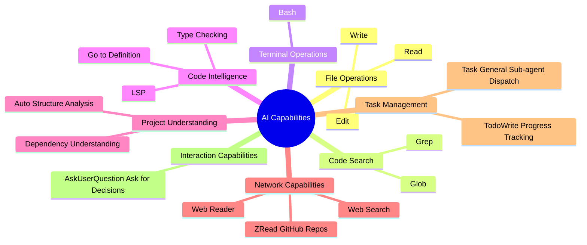
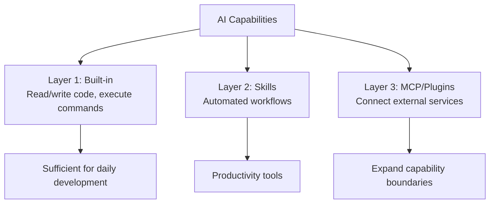

# 2.3 MCP, Plugins, and Skills 🟡

> **After reading this section, you will learn:**
> - Understand the differences and use cases between MCP, plugins, and Skills, and know how to choose based on your needs
> - Master plugin store installation methods and learn about common plugins (typescript-lsp, frontend-design, feature-dev, etc.)
> - Learn MCP server configuration and authentication, and be able to connect to external services like databases, APIs, and GitHub
> - Understand how Skills work and key points for creating them, and be able to create reusable skill packages
> - Develop security awareness and learn to configure reasonable permission restrictions for MCP and plugins

Xiaoming's "Personal Douban" project is already running. But he noticed a few problems: every time he asks the AI to check code, he has to re-describe the review process; he wants the AI to directly query data from the database, but the AI says it can't; a friend recommended the `frontend-design` plugin that helps the AI generate better-looking interfaces, but he doesn't know how to install it.

This section addresses these three problems. They correspond to three extension methods: **Skills** (let AI remember workflows), **MCP** (let AI connect to external services), and **plugins** (one-click install bundles of the first two).

> As mentioned in the preface: "Skills define custom instructions" and "MCP lets AI connect to external tools." In most cases, you only need to **install and use existing MCP servers**, not develop your own.

::: tip 🎯 Claude Code Feature Overview
Want to understand Claude Code's full capabilities regarding MCP, plugins, and Skills? Visit **[cclog.vibevibe.cn](https://cclog.vibevibe.cn)** to see all feature updates from v0.2 to v2.1, including detailed history of MCP ecosystem evolution, plugin system development, and Skills mechanism improvements.
:::

::: tip Beginner Learning Path

**If you're a beginner**, we recommend learning in this order:

1. First understand built-in capabilities (next section of this chapter) → covers most scenarios
2. When you need external services, prioritize installing plugins (simpler than MCP configuration)
3. After getting familiar, configure MCP based on specific needs
4. Finally consider creating your own Skills (advanced content)

**Core principle**: Use built-in when possible, use extensions only when necessary; use plugins instead of manual configuration when possible.

:::

**Resource Navigation**:
- Plugin Marketplace: [claude-plugins.dev](https://claude-plugins.dev/) - browse and search for plugins
- Skills Marketplace: [skillsmp.com](https://skillsmp.com/zh) - 2300+ Skills search directory
- Agent Skills: [agentskills.io](https://agentskills.io/home) - Agent Skills specification and marketplace
- Official Plugin Library: [GitHub - anthropics/claude-code/plugins](https://github.com/anthropics/claude-code/tree/main/plugins)
- Official Skills Library: [GitHub - anthropics/skills](https://github.com/anthropics/skills)

## Prerequisites

Xiaoming wants the AI to query a database. This requires a "wire" to connect the AI and the database—

::: tip What is MCP

**MCP** = External Tool Connection

MCP (Model Context Protocol) lets AI connect to external services (databases, APIs, file systems, etc.). MCP can be configured independently or packaged in plugins.

:::

But manual wiring is quite troublesome. Is there an easier way? Yes—

::: tip What are Plugins

**Plugins** = Extension Containers (Distribution Units)

Plugins are feature packages that can include Skills, Commands, Agents, Hooks, and MCP Servers. Install through the plugin store with one click—simpler than manually configuring MCP.

| Need | Recommended Approach |
|------|-------------------|
| Code intelligence (LSP) | Install plugin |
| Connect to external services | Configure MCP or install plugin with MCP included |
| Automated workflows | Create or install Skills |
| One-click install multiple features | Install plugin |

**Core principle**: Use plugins instead of manual MCP configuration when possible; use built-in instead of extensions when possible.

:::

The external service connection problem is solved. But there's another type of need: letting AI remember your workflow—

::: tip What are Skills

**Skills** = Reusable AI Skill Packages

Skills define specific capabilities through `SKILL.md` files. Claude automatically determines whether to use them based on request content.

**Invocation Methods**:
- **Skills**: Model invocation — AI decides automatically based on description
- **Slash commands**: User invocation — user explicitly types to trigger

:::

**Unsure which to use? Try this decision guide:**

<MCPDecisionTree />

### AI Capability Scope You Must Know

Before installing any extensions, first understand one thing: AI can already do a lot out of the box. Many people rush to install plugins when built-in capabilities are sufficient. The table below helps you quickly assess—

**What AI can do**:

| AI Can Do | AI Cannot Do |
|-----------|--------------|
| Read any file in your project | Access arbitrary paths on your computer |
| Run commands you allow | Execute operations requiring a GUI |
| Understand code structure and logic | "Remember" content from previous conversations |
| Connect to external services you configure | Bypass system security restrictions |
| Automatically choose appropriate tools | Guess what you're thinking (so be explicit) |

:::tip Key Insight
**You only need to tell the AI what you want to do; the AI will automatically choose the appropriate method. You don't need to know whether the AI uses Read (read file), Edit (edit file), Grep (search content), Glob (find files), or Bash (run commands), or even Python (run scripts).**
:::
**You don't need to remember tool details**

| Don't Need to Remember | Reason |
|------------------------|--------|
| Tool names (Read, Edit, Grep...) | AI chooses automatically |
| Specific configuration syntax | Let AI reference official docs to generate for you |
| All available MCP/plugin servers | Search and install on demand |

**You only need to clearly describe what you want to do in natural language.**

## What Capabilities Does AI Have

Before configuring MCP or Skills, remember: **AI already has many built-in capabilities**.

::: details View Complete List of Built-in Tools



### Tools Categorized by Type

**1. File Operation Tools** - Foundation for reading/writing code

| Capability | Tool | Example |
|------------|------|---------|
| Read file | Read | "Read package.json" |
| Edit file | Edit | "Rename function to xxx" |
| Create file | Write | "Create new component" |

**2. Search Tools** - Find what you need

| Capability | Tool | Example |
|------------|------|---------|
| Search code content | Grep | "Search all TODOs" |
| Find files | Glob | "Find all .ts files" |

**3. Terminal Tools** - Execute commands

| Capability | Tool | Example |
|------------|------|---------|
| Run commands | Bash | "Run pnpm test" |

**4. Code Intelligence** - Requires additional plugin support

| Capability | Plugin | Example |
|------------|--------|---------|
| TypeScript/JavaScript type checking, go to definition | typescript-lsp | "Where is this function defined?" |
| Python type checking, code completion | pyright-lsp | "What's the type of this class?" |


LSP (Language Server Protocol) capabilities are **not built-in** and require additional plugin installation:

```bash
# Open plugin management interface
/plugin

# Search for typescript-lsp or pyright-lsp and install
```

Supported languages include: TypeScript, JavaScript, Python, Rust, Go, C/C++, C#, PHP, Java, Ruby, Swift, etc.


**5. Project Understanding** - Automatic analysis

| Capability | Tool | Example |
|------------|------|---------|
| Analyze structure, understand dependencies | Auto analysis | "Analyze project structure" |

**6. Network Capabilities** - Requires MCP/plugin configuration

| Capability | Tool | Configuration Required |
|------------|------|------------------------|
| Read web page content | Web Reader MCP | ✅ |
| Web search | Web Search MCP | ✅ |
| Read GitHub repository | ZRead MCP | ✅ |


**What AI can read**:
- ✅ Public web links (via MCP/plugins)
- ✅ GitHub repository files (via ZRead MCP)
- ✅ Documentation sites (via Web Reader MCP)

**What AI cannot read**:
- ❌ Pages requiring login
- ❌ Local file paths (outside project directory)
- ❌ Websites blocked by firewalls


**7. Task Management** - AI uses automatically, you just see the results

| Capability | Tool | Do You Need to Know? |
|------------|------|----------------------|
| Track multi-step task progress | TodoWrite | ❌ AI uses automatically, you see progress |
| Invoke general sub-agent for complex tasks | Task | ❌ AI calls automatically, you don't need to know |

**8. Interaction Capabilities** - AI uses automatically, you just answer

| Capability | Tool | Do You Need to Know? |
|------------|------|----------------------|
| Ask you questions for decisions | AskUserQuestion | ❌ AI uses automatically, you just answer |


### Decision Criteria: Built-in Tools vs Extensions?

```bash
# ✅ Scenarios where built-in tools are sufficient
"Read and analyze a file"      → Use the Read tool
"Run a command and process results"   → Use the Bash tool
"Implement a feature"        → Describe the task directly, AI will plan automatically

# ❌ Scenarios requiring extensions
"Query a PostgreSQL database"     → Needs MCP/plugin
"Read a Google Drive document"     → Needs MCP/plugin
"Call Slack API to send messages"    → Needs MCP/plugin
```

**When to use extensions**:

| Need | Approach |
|------|----------|
| ✅ Database queries | MCP/plugin |
| ✅ Web search | MCP/plugin |
| ✅ Read external APIs | MCP/plugin |
| ✅ Repeated complex workflows | Skills |
| ❌ One-off tasks | Use natural language directly |

If your needs fall on the "needs extension" side, the easiest approach is to install a plugin.

:::

## Plugins: The Simplest Extension Method

Xiaoming saw someone in the community using Claude Code to generate beautiful frontend interfaces. After asking, he learned they had the `frontend-design` plugin installed. He wanted to try it too.

::: tip Plugin or MCP?

You want AI to connect to a PostgreSQL database.

**Using a plugin**:
```bash
/plugin
# Search for postgres, press space to select, press i to install
# Done, use immediately
```

**Using MCP**:
```bash
# Find configuration docs
# Edit .mcp.json
# Check if format is correct
# Restart Claude Code
```

**Exact same functionality**, but the plugin saves 5 minutes.

| Your situation | Choose | Reason |
|---------|--------|------|
| Want to try quickly | **Plugin** | One-click install, zero config |
| Need to customize parameters | MCP | Manual editing, flexible control |
| Team collaboration | Either | Plugin is simple, MCP is transparent |

**Recommendation**: Start with plugins, switch to MCP if you find them insufficient.

:::

### Installation Methods

**Method 1: Via Plugin Store (Recommended)**

```bash
/plugin 
# Open plugin management interface, search for needed plugins, press space to select, press i to install
```

**Method 2: Via Command Installation**

```bash
# Example
/plugin install frontend-design@anthropics
```

**If you can't find the plugin you need, consider adding the marketplace where it's hosted**

```bash
# Add marketplace
/plugin marketplace add your-org/claude-plugins

# Browse available plugins
/plugin
```

### Recommended Plugins

::: tip Recommended Plugins (Must-read for Beginners)

For beginners, start with these plugins:

**Basic Development**:
- `typescript-lsp` - TypeScript/JavaScript type checking, code completion, go-to-definition
- `pyright-lsp` - Python type checking and code intelligence
- `frontend-design` - Generate high-quality frontend interfaces

**Workflows**:
- `feature-dev` - Complete feature development workflow
- `pr-review-toolkit` - PR review toolkit
- `commit-commands` - Git commit workflow

**Installation**:
```bash
# Open plugin management interface, search for the above plugins and install
/plugin
```

:::


::: details View Complete Plugin Recommendations

#### LSP Language Servers (Code Intelligence)

| Plugin | Function |
|------|------|
| **typescript-lsp** | TypeScript/JavaScript type checking, code completion, go-to-definition |
| **pyright-lsp** | Python type checking and code intelligence |
| **rust-analyzer-lsp** | Rust language server, code intelligence and analysis |
| **gopls-lsp** | Go language server, code intelligence and refactoring |
| **clangd-lsp** | C/C++ language server, code intelligence |
| **csharp-lsp** | C# language server, code intelligence |
| **php-lsp** | PHP language server (Intelephense), code intelligence |
| **swift-lsp** | Swift language server (SourceKit-LSP), code intelligence |
| **jdtls-lsp** | Java language server, code intelligence |
| **lua-lsp** | Lua language server, code intelligence |

#### Development Workflows

| Plugin | Function |
|------|------|
| **frontend-design** | Generate high-quality frontend interfaces, avoiding generic AI aesthetics |
| **feature-dev** | Complete feature development workflow (7 phases: discovery, exploration, clarification, design, implementation, review, summary) |
| **pr-review-toolkit** | PR review toolkit, focusing on code quality, testing, error handling |
| **commit-commands** | Simplified Git workflow, commit, push, create PR with one command |
| **ralph-wiggum** | Iterative AI development loop technique |

#### Code Quality & Security

| Plugin | Function |
|------|------|
| **code-review** | Automated code review, multi-specialist agents analyze in parallel, filter false positives based on confidence scoring |
| **security-guidance** | Security reminder hooks, warn about command injection, XSS, unsafe code patterns |
| **hookify** | Automatically create hooks, prevent bad behavior by analyzing conversation patterns or explicit instructions |

#### Development Toolkits

| Plugin | Function |
|------|------|
| **agent-sdk-dev** | Agent SDK development toolkit, create and validate Python/TypeScript Agent SDK applications |
| **plugin-dev** | Plugin development toolkit, hooks, MCP integration, plugin structure, marketplace publishing guidance |

#### Output Styles

| Plugin | Function |
|------|------|
| **explanatory-output-style** | Explanatory output style, detailed explanation of AI's thinking and decision process |
| **learning-output-style** | Learning-oriented output, combining interactive learning with educational insights |

#### Examples & Templates

| Plugin | Function |
|------|------|
| **example-plugin** | Plugin development example template |

**Installation**: Type `/plugin` then search and install needed plugins.

:::


After installing a plugin, just describe your needs in natural language—no additional configuration needed. But if the plugin store doesn't have the functionality you need—like connecting to a specific database or API—you'll need to configure MCP yourself.

### Using Plugins

Once installed, plugins automatically integrate into AI capabilities without extra configuration:

```bash
# Frontend design (after installing frontend-design)
"Create a user login page with modern design style"

# Feature development (after installing feature-dev)
"Develop a user comments feature using the feature-dev workflow"

# Code review (after installing pr-review-toolkit)
"Check this code with the PR review toolkit"
```
### Plugin Structure

::: details Plugin Directory Structure

A plugin is an npm package containing the following components:

```
my-plugin/
├── .claude-plugin/
│   ├── plugin.json          # Plugin metadata
│   └── marketplace.json     # Marketplace listing (optional)
├── commands/                 # Custom slash commands (optional)
│   └── hello.md
├── agents/                   # Custom agents (optional)
│   └── helper.md
├── skills/                   # Agent skills (optional)
│   └── my-skill/
│       └── SKILL.md
├── hooks/                    # Event handlers (optional)
│   └── hooks.json
└── .mcp.json                # MCP server configuration (optional)
```

**Component Descriptions**:
- **plugin.json**: Plugin metadata (name, description, version, author)
- **commands/**: Custom slash commands (Markdown files)
- **agents/**: Sub-agent definitions
- **skills/**: Agent skills (SKILL.md files)
- **hooks/**: Event handlers (hooks.json)
- **.mcp.json**: MCP server configuration

:::

### Plugin Management

::: details Management Commands

```bash
# View installed plugins
/plugin

# Enable a disabled plugin
/plugin enable plugin-name@marketplace-name

# Disable without uninstalling
/plugin disable plugin-name@marketplace-name

# Uninstall a plugin
/plugin uninstall plugin-name@marketplace-name
```

:::

::: details Team Collaboration

Configure plugins at the repository level to ensure consistent tooling across your entire team.

**Setting up team plugins**:

1. Add marketplace and plugin configurations to your repository's `.claude/settings.json`
2. Team members trust the repository folder
3. Plugins are automatically installed for all team members

**Configuration example** (`.claude/settings.json`):

```json
{
  "pluginMarketplaces": [
    {
      "source": "your-org/claude-plugins"
    }
  ],
  "plugins": [
    {
      "name": "formatter",
      "marketplace": "your-org"
    }
  ]
}
```

:::

## MCP: Connecting to External Services

Xiaoming has reached the backend phase of his project and needs the AI to help him query user data in PostgreSQL. He tries saying "check how many users are in the database," and the AI responds: "I don't have the ability to access databases."

This is the problem MCP solves. You can think of MCP as a **data cable**—one end plugs into the AI, the other into external services (databases, GitHub, Figma...). Without this cable, no matter how smart the AI is, it can't touch external data.

::: warning Must Read Before Installation

**About compatibility**: MCP is **not universal** across different CLI tools, and installation methods may vary.

**About installation methods**:
- **Within IDE**: Usually has an MCP marketplace for direct installation
- **CLI tools**: Manual configuration through config files
- **One-click configuration tools**: Such as GLM config tool, which automatically pre-installs some MCPs

**About authentication**: Some MCPs require an API Key to use (e.g., OpenAI, Stripe, GitHub), which needs to be provided during configuration.

:::

::: tip MCPs Included by Default in GLM One-Click Config Tool

When using the GLM one-click configuration tool, the following MCPs are automatically installed:

| MCP | Function |
|-----|----------|
| **Vision MCP** | Image analysis (screenshots, design mockups, etc.) |
| **Web Search MCP** | Web search to get latest information |
| **Web Reader MCP** | Read web page link content |
| **ZRead MCP** | Read GitHub repository files and directories |

These are the most commonly used network capabilities in development, ready to use out of the box.

:::

### Popular MCP Servers

| Category | MCP | Function |
|----------|-----|----------|
| **Development & Debugging** | [GitHub MCP](https://github.com/github/github-mcp-server) | Operate code repositories, PRs, Issues, and CI workflows |
| | [Chrome DevTools MCP](https://github.com/ChromeDevTools/chrome-devtools-mcp) | Control browser for page debugging, network analysis, and automated inspection |
| | [ShadCN MCP](https://www.shadcn.com.cn/docs/mcp) | Generate ready-to-use React + Tailwind UI components |
| | [Semgrep MCP](https://semgrep.dev/docs/mcp) | Static code security scanning and rule detection |
| **Databases** | [PostgreSQL MCP](https://github.com/crystaldba/postgres-mcp) | Configurable read/write access and performance analysis |
| | [Neon MCP](https://neon.com/docs/ai/neon-mcp-server) | On-demand creation and management of Serverless PostgreSQL databases |
| | [Supabase MCP](https://supabase.com/docs/guides/getting-started/mcp) | All-in-one backend with auth, database, storage, and real-time capabilities |
| **Deployment & Hosting** | [Vercel MCP](https://vercel.com/docs/mcp) | Automatically deploy frontend apps and generate preview environments |
| | [Cloudflare MCP](https://github.com/cloudflare/mcp-server-cloudflare) | Manage edge computing resources (Workers, KV, R2) |
| **Design & Media** | [Figma MCP](https://developers.figma.com/docs/figma-mcp-server/remote-server-installation/) | Read and modify Figma design files, enabling design-to-code automation |
| | [Replicate MCP](https://mcp.replicate.com/) | Call image generation APIs to create illustrations |
| **Documentation & Context** | [Context7 MCP](https://context7.com/docs/overview) | Transform official real-time latest documentation into reliable context |
| | [Ref MCP](https://ref.tools/mcp) | Similar to Context7, reduces AI hallucinations |
| **Payments** | [Stripe MCP](https://docs.stripe.com/mcp) | Automate creation of payments, subscriptions, and Webhooks |

**Note**: Some MCPs require an API Key to use. For more MCP servers, visit the [MCP Collection](https://github.com/modelcontextprotocol/servers).

:::
Since MCP servers are updated frequently, it's recommended to click the links above or search the official websites for the latest usage instructions.
:::

### Using MCP

```bash
# Query database
"Query PostgreSQL: get user registration count for the last 7 days"

# Read from GitHub
"Check repository status: last 5 PRs"

# Web search
"Search: What's new in Next.js 16"

# Read files
"Read /path/to/file.md and summarize the content"
```

Once MCP is configured, the AI can directly operate external services. But you may have noticed that MCP solves the "connection" problem—letting the AI reach external data. There's another type of need it can't solve: **making the AI remember your workflows**. Having to repeatedly describe your code review process every time is inefficient. This is the problem Skills solves.

### Other Installation Methods

::: details Adding from JSON Configuration

If you have a JSON configuration for an MCP server, you can add it directly:

```bash
# Basic syntax
claude mcp add-json <name> '<json>'

# Example: Add HTTP server with JSON configuration
claude mcp add-json weather-api '{"type":"http","url":"https://api.weather.com/mcp","headers":{"Authorization":"Bearer token"}}'

# Example: Add stdio server with JSON configuration
claude mcp add-json local-weather '{"type":"stdio","command":"/path/to/weather-cli","args":["--api-key","abc123"],"env":{"CACHE_DIR":"/tmp"}}'
```

:::


::: details Viewing Installation and Configuration

### Three Installation Methods


#### Option 1: Add Remote HTTP Server (Recommended)

HTTP servers are the recommended option for connecting to remote MCP servers. This is the most widely supported transport method for cloud services.

```bash
# Basic syntax
claude mcp add --transport http <name> <url>

# Real example: Connect to Notion
claude mcp add --transport http notion https://mcp.notion.com/mcp

# Example with Bearer token
claude mcp add --transport http secure-api https://api.example.com/mcp \
  --header "Authorization: Bearer your-token"
```


#### Option 2: Add Local stdio Server

Stdio servers run as local processes on your computer. They're perfect for tools that need direct system access or custom scripts.

```bash
# Basic syntax
claude mcp add --transport stdio <name> <command> [args...]

# Real example: Add Airtable server
claude mcp add --transport stdio airtable --env AIRTABLE_API_KEY=YOUR_KEY \
  -- npx -y airtable-mcp-server
```


##### tip Understanding the "--" Argument

`--` (double dash) separates the CLI tool's flags from the command and arguments passed to the MCP server. Everything before `--` is the tool's options (like `--env`, `--scope`), and everything after `--` is the actual command to run the MCP server.

For example:
- `claude mcp add --transport stdio myserver -- npx server` → Runs `npx server`
- `claude mcp add --transport stdio myserver --env KEY=value -- python server.py --port 8080` → Runs `python server.py --port 8080` with `KEY=value` set in the environment

This prevents conflicts between the tool's flags and the server's flags.


##### Windows Users

On native Windows (not WSL), local MCP servers using `npx` require a `cmd /c` wrapper to ensure proper execution.

```bash
# This creates command="cmd" that Windows can execute
claude mcp add --transport stdio my-server -- cmd /c npx -y @some/package
```

Without the `cmd /c` wrapper, you'll encounter "connection closed" errors because Windows cannot directly execute `npx`.


:::

### Managing MCP Servers

Simply type `/mcp` and follow the prompts.

:::

### MCP Authentication

::: details OAuth Authentication Configuration

Many cloud-based MCP servers require authentication. Claude Code supports OAuth 2.0 for secure connections.

```bash
# 1. Add a server that requires authentication
claude mcp add --transport http sentry https://mcp.sentry.dev/mcp

# 2. Use the /mcp command in Claude Code
> /mcp

# 3. Follow the login steps in your browser
```
:::
- Authentication tokens are stored securely and refresh automatically
- Use "Clear Authentication" in the `/mcp` menu to revoke access
- Copy the provided URL if your browser doesn't open automatically
- OAuth authentication works for HTTP servers
:::


### MCP Prompts

::: details @ MCP 

You can use @ mentions to reference MCP resources, similar to how you reference files.

**Reference format**: `@server:protocol://resource/path`

```bash
# Reference a specific resource
> "Can you analyze @github:issue://123 and suggest a fix?"
> "Please check the API documentation at @docs:file://api/authentication"

# Multiple resource references
> "Compare @postgres:schema://users and @docs:file://database/user-model"
```
:::
- Resources are automatically fetched and attached when referenced
- Resource paths support fuzzy search in @ mention autocomplete
- Claude Code automatically provides tools to list and read MCP resources when the server supports it


:::

::: details Using MCP Prompts as Slash Commands

MCP servers can expose prompts that appear as slash commands in Claude Code.

**Command format**: `/mcp__servername__promptname`

```bash
# Execute a prompt without parameters
> /mcp__github__list_prs

# Execute a prompt with parameters
> /mcp__github__pr_review 456
> /mcp__jira__create_issue "Bug in login flow" high
```
:::
- MCP prompts are dynamically discovered from connected servers
- Parameters are parsed according to the prompt's defined arguments
- Prompt results are injected directly into the conversation
- Server and prompt names are normalized (spaces become underscores)
:::


## Skills: Custom Workflows

Xiaoming had to repeat the same requirements every time he asked AI to review code: "First run tests, then check types, then look for leftover console.log statements, and finally check for security issues." After saying it ten times, he got annoyed.

Even worse, every new session, the AI forgot this workflow. He had to start from scratch again.

Imagine a new intern joined the company—capable, but with amnesia every morning. The review process you taught yesterday has to be retaught today. What do you do? Write an instruction checklist and pin it to the wall—every day they come in, glance at it, and know what to do.

**Skills are that checklist pinned to the wall**, except it's not for humans to read—it's for AI.

::: tip Scenario: Daily Repetitive Formats

You write daily reports every day with a fixed format: date, completed items, tomorrow's plan. Having to describe the format each time is annoying.

**Skills solve this**: write the format requirements into `SKILL.md`, and from then on just say "write daily report"—AI automatically outputs in the correct format.

**Skills** = your personalized instruction templates

**Two ways to use**:

| Method | Example | Who Decides |
|--------|---------|-------------|
| **Auto-trigger** | Say "write daily report" → AI automatically uses daily-report Skill | AI judges |
| **Slash command** | Type `/daily-report` | You decide |

**Beginner recommendations**:
1. Start with existing ones (built into plugins or downloaded)
2. Create your own when you have repetitive needs
3. For team sharing, place in project directory

:::

**Why Skills are especially important for Vibe Coders?**

Previously you taught AI how to do things in conversation, and it forgot after that round. Next new session, start over again. Skills change this: **your experience is no longer a one-time conversation, but reusable knowledge assets**. The workflows you accumulate don't disappear when the session ends.

This is also the biggest difference between Skills and traditional automation scripts. Scripts are rigid—step 1 then step 2, stuck when encountering surprises. Skills are flexible—more like a set of guiding principles that AI adjusts based on actual circumstances. For example, your review Skill says "check test coverage," but this project doesn't have a testing framework yet—AI won't get stuck and error out, it will tell you "suggest configuring test framework first" then continue with other checks.

**When you need to create Skills**:

| Your Situation | Solution |
|----------------|----------|
| Daily repetitive tasks with same format | Create Skill, configure once, use forever |
| Rules that need to stay consistent across sessions | Write as Skill, enforced automatically |
| Team needs unified output format | Project-level Skill, shared by everyone |

**Skills resources**:
- [skillsmp.com](https://skillsmp.com/zh) - 2300+ Skills search directory (Chinese)
- [agentskills.io](https://agentskills.io/home) - Agent Skills specification and marketplace
- [github.com/anthropics/skills](https://github.com/anthropics/skills) - Official Skills library


### How to Get Skills

**From plugins** (recommended for beginners)

Many plugins include Skills that become automatically available after installation:

```bash
# After installing plugin, Skills included in the plugin are automatically loaded
/plugin install feature-dev@anthropics
```

**Create your own** (advanced)

Two ways:

| Method | Use Case |
|--------|----------|
| Define through conversation | One-time needs, quick testing |
| Create SKILL.md file | Long-term use, multi-project sharing |

### Creating Skills

**No coding required, just describe verbally**

Many people think creating Skills requires programming skills. It doesn't—`SKILL.md` is essentially natural language. You describe workflows in Chinese, and AI can execute accordingly.

And you don't need to get it perfect the first time. See how Xiaoming iteratively created a code review Skill:

**Round 1**—Xiaoming tells AI:
```
Help me create a code review Skill that checks type safety and test coverage.
```
AI generated the first draft `SKILL.md`. Xiaoming tested it and found it missed security checks.

**Round 2**—Xiaoming continues:
```
Add security checks, especially for XSS and SQL injection.
```
AI updated the Skill. Tested again—functionally correct, but output was plain text, not pretty.

**Round 3**—Xiaoming adds one more thing:
```
Output review results as Markdown tables, with severity level for each issue.
```
Final version ready. Throughout the process, Xiaoming didn't write a single line of code—entirely verbal, AI helped him turn natural language into an executable Skill.

**Key mindset**: don't pursue perfection on the first try. Get it running first, tell AI to fix what you're unhappy with. This "build, test, and refine as you go" approach is more efficient than trying to design a perfect Skill from the start.

::: tip SKILL.md File Structure

```yaml
---
name: your-skill-name
description: Brief description of what this Skill does and when to use it
---

# Your Skill Name

## Instructions
Provide clear, step-by-step guidance for the AI.

## Examples
Show concrete examples of using this Skill.
```

**Field requirements**:

* `name`: Must use only lowercase letters, numbers, and hyphens (max 64 characters)
* `description`: Brief description of the Skill and when to use it (max 1024 characters)

**Creation tips**:

| Tip | Description |
|-----|-------------|
| **Concise** | Assume AI is already smart, only add context it doesn't have |
| **Naming** | Use gerund form: `testing-code`, `processing-files` |
| **Description** | Third person, describe function and when to use: "Use when..." |
| **Specificity** | Include Skill's function, usage timing, and key terms in description |
| **Flexibility** | High (text instructions) → Medium (pseudocode) → Low (exact scripts) |

**Restrict tool access with allowed-tools**:

```yaml
---
name: safe-file-reader
description: Read files without making changes. Use when you need read-only file access.
allowed-tools: Read, Grep, Glob
---

# Safe File Reader

This Skill provides read-only file access.

## Instructions
1. Use Read to view file contents
2. Use Grep to search within files
3. Use Glob to find files by pattern
```

:::
**Skills storage locations**:

```bash
# Personal Skills (available for all projects)
~/.claude/skills/

# Project Skills (current project only)
.claude/skills/

# Plugin Skills (automatically available when plugin installed)
# skills/ directory inside plugin package
```

**Usage scenarios**:

| Location | Use Case |
|----------|----------|
| **Personal Skills** | Your personal workflows and preferences, experimental Skills, personal productivity tools |
| **Project Skills** | Team workflows and conventions, project-specific expertise, shared utilities and scripts |
| **Plugin Skills** | Automatically available when plugin installed, skills/ directory inside plugin package |### Sharing Skills with Your Team ⭐

::: tip Recommended Approach

**Share via project repository** (easiest):

Place Skill files in the project's `.claude/skills/` directory and commit to Git. After team members pull the code, the Skill becomes automatically available.

**Specific steps**:

1. Create a `.claude/skills/` folder in the project root
2. Create a `SKILL.md` file in the folder with your Skill content
3. Commit to Git and push to the remote repository
4. Team members run `git pull`, and the Skill is immediately available

**Why we recommend this**:

| Approach | Pros | Cons |
|------|------|------|
| **Project repository** | Auto-sync, version control, no extra steps | Requires Git commits |
| Plugin distribution | Good for large teams, centralized management | Requires creating and maintaining plugins |

For most teams, the project repository is the simplest approach.

:::

**Best practices**:

| Best Practice | Description |
|---------|------|
| **Keep Skills focused** | One Skill solves one function |
| **Write clear descriptions** | Help AI discover when to use it |
| **Test with your team** | Have teammates use and provide feedback |
| **Version tracking** | Add version history in SKILL.md |

### Creating via Conversation (Temporary Solution)

```bash
# Define in conversation
"Create a test workflow: run tests, generate coverage, analyze failures"

# AI will remember this workflow for the current session
# For permanent use, create a SKILL.md file
```

**What if you run into issues?**

When creating or using Skills, you might encounter some situations:

- **AI doesn't automatically use your Skill**: Check the `description` field in `SKILL.md`—the more specific the description, the easier it is for AI to determine when to use it. Changing "code review tool" to "when user submits code or requests review, run type checking, tests, and security scans" makes a big difference.
- **Skill stops halfway through execution**: This is usually due to context compression from length. Don't panic—just tell AI "continue the previous task". If compression happens frequently, consider splitting one large Skill into several smaller ones.
- **Execution results don't match expectations**: Don't rewrite the Skill from scratch—just tell AI what's wrong and what result you expect. AI will help you modify `SKILL.md`—again, iterate and improve, don't aim for perfection in one go.

### Common Skill Examples

| Skill | Function | Use Case |
|-------|------|----------|
| **Test workflow** | Run tests and analyze | Daily testing |
| **Code review** | Check types and security | Pre-commit review |
| **Doc generation** | Generate API documentation | After interface development |

### Using Existing Skills

**Skills included in plugins**:

After installing a plugin, Skills within it load automatically—no additional configuration needed:

```bash
# Install plugin
/plugin install feature-dev@anthropics

# AI automatically recognizes and uses Skills included in the plugin
# No manual action required
```

**Debugging Skills**:

```bash
# Check if Skills are loaded
"List all available skills"

# Test a Skill
"Test the test-runner skill"
```

Now you have a complete extension toolkit—plugins for one-click installation, MCP for connecting external services, and Skills for solidifying workflows. Finally, let's cover security considerations.

## Security Considerations

::: warning MCP Security Configuration

**Database MCP**:
- Use read-only account permissions
- Don't use write permissions directly in production environments

**Filesystem MCP**:
- Restrict access paths, only open necessary directories
- Don't allow access to root directory `/`

**GitHub MCP**:
- Use tokens with expiration dates
- Use minimum permission scope (read-only or specific repositories)
:::

::: warning Plugin and Skill Security

**Plugin security**:
- Only install plugins from trusted sources
- Review plugin source code and permission requirements
- Official plugins are more reliable

**Skill security**:
- Use `allowed-tools` to restrict tool access
- Read-only Skills should be limited to read-only tools
- Regularly review and update Skills
:::

## FAQ

### Q1: How do I choose between Skills, MCP, and plugins?

**A**: Depends on your needs.

| Need | Choice |
|------|------|
| Automate workflows | Skills |
| Connect external services | MCP or Plugin |
| Quick commands | Skills |
| Read databases | MCP or Plugin |
| One-click installation | Plugin (simpler) |
| Complete feature package | Plugin (includes commands+tools+workflows) |

**Priority recommendation**: Plugin > MCP > Skills (from simple to complex)

### Q2: MCP/Plugin configuration not working?

**A**: Check the following:

1. **Restart the tool**: Configuration requires fully quitting and reopening
2. **Check npx**: Ensure Node.js is installed and `npx` is available
3. **View logs**: Claude Desktop → Help → Developer → Toggle Logs
4. **Verify connection**: Database connection strings, GitHub tokens are correct

### Q3: How to find more MCPs/plugins?

**A**: Visit official resources:

- MCP repository (https://github.com/modelcontextprotocol/servers)
- Use `/plugin` command to browse the plugin store

### Q4: Will MCPs/plugins leak my data?

**A**:

**Official MCP/plugin servers**:
- Open source code, can be audited
- Usually connect directly to target services (e.g., GitHub API)
- Don't route through third-party servers

**Third-party MCP/plugin servers**:
- Review source code to confirm data handling
- Authorize permissions carefully
- Use read-only tokens

### Q5: AI not using my Skill?

**A**: Check the following:

1. **Is the description specific?**: Vague descriptions make discovery difficult
2. **Is YAML valid?**: Run validation to check for syntax errors
3. **Is Skill in the right location?**: Check file path
4. **Do Skills conflict?**: Use different trigger terms to help AI choose the correct Skill

## Core Philosophy

**Layers of extending AI capabilities**:



**Remember**:
1. **Built-in first**: Let AI use built-in capabilities first
2. **Extend as needed**: Consider MCP/Skill only when you find limitations
3. **Security first**: Restrict permissions, use read-only accounts
4. **Keep it simple**: Don't over-configure

## Related Content

- Prerequisite: 2.2 VibeCoding Workflow
- Details: 2.4 Project Rules Configuration
- Extension: [MCP Official Repository](https://github.com/modelcontextprotocol/servers)
- Extension: [Official plugins repository](https://github.com/anthropics/claude-plugins-official)
- Extension (Agent Skills, Claude Docs): [Overview](https://platform.claude.com/docs/en/agents-and-tools/agent-skills/overview) · [Authoring best practices](https://platform.claude.com/docs/en/agents-and-tools/agent-skills/best-practices) · [Quickstart](https://platform.claude.com/docs/en/agents-and-tools/agent-skills/quickstart) · [Skills in the API](https://platform.claude.com/docs/en/build-with-claude/skills-guide)
- Extension (Claude Code project skills): [Claude Code docs · Skills](https://code.claude.com/docs/en/skills)
- Extension (community plugin · codebase knowledge graph): [Understand Anything](https://github.com/Lum1104/Understand-Anything) — Claude Code plugin marketplace: multi-agent scan, searchable knowledge graph, interactive dashboard; also supports Codex, OpenCode, Cursor, etc. (see [README](https://github.com/Lum1104/Understand-Anything/blob/main/README.md))